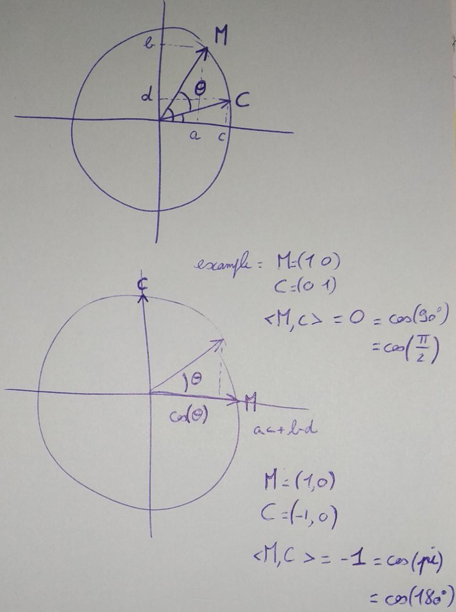

```{r setup, include=FALSE}
knitr::opts_chunk$set(echo = TRUE)
```

<hr>

## Question 1

**Let us consider the model of i.i.d. interspike intervals.**

1. **Consider the parametric model with density $\theta e^{-\theta(x-\eta)}\mathbb{1}_{x\ge\eta}$, with $\theta$ and $\eta$ positive unknown parameters. Compute the likelihood for $n$ observations.**


Given $n$ observations $X_1, ..., X_n$ independent and identically distributed (assumption of interspike intervals) with $\forall i in \{1, ..., n\}, X_i \sim \theta e^{-\theta(x-\eta)}\mathbb{1}_{x\ge\eta}$, we can state the likelihood of such $n$ observations as:

\begin{align}
f_i(\theta, \eta) &= \theta e^{-\theta(x_i-\eta)}\mathbb{1}_{x_i\ge\eta}\quad\text{(with $f$ the density of $X_i$)}\\
\mathcal{L}(\theta, \eta) &= \prod^n_{i=1}f_i(\theta, \eta)\\
&= \prod^n_{i=1} \theta e^{-\theta(x_i-\eta)}\mathbb{1}_{min(x_i)\ge\eta}\\
&= \theta^n e^{-\theta\sum^n_{i=1}(x_i-\eta)}\mathbb{1}_{min(x_i)\ge\eta}
\end{align}

We obtain:

\begin{align}
\mathcal{L}_n(\theta, \eta) &= \theta^n e^{-\theta\sum^n_{i=1}(x_i-\eta)}\mathbb{1}_{min(X)\ge\eta}\\
\end{align}


2. **Simulate $n = 10$ i.i.d ISI with this model. For fixed $\theta$, plot the likelihood as a function of
$\eta$.**

We first declare a set of functions to help up answer the question.

```{r likelihood functions}

isi_generate <- function(n, theta, eta) {
  # Generates a number n of ISI observations 
  # with parameters theta and eta with eta a time
  # delay starting from 0
  rexp(n, theta) + eta
}

isi_distribution_plot <- function(observations, theta, eta) {
  # Plots the distribution of ISI observations as 
  # an histogram
  hist(observations, 
       main = paste("Distribution of ISI given Theta=", theta, ", Eta=", eta),
       xlim = c(0, max(simulations)+1))
}

isi_likelihood <- function(observations, theta, eta){
  # Computes the likelihood of a set of ISI observations
  check_min = min(observations) >= eta
  if (check_min) {
    theta^n*exp(-theta*sum(observations-eta))
  } else {0}
}

isi_likelihood_plot_given_theta <- function(observations, theta) {
  # Given a fixed theta and observations provided as function
  # arguments, computes the likelihood of the observations over a
  # range of eta parameters and plot the resulting likelihoods
  etas = seq(0, 10, length.out=50)
  likelihoods = rep(0, 50)
  for (i in 1:50) {
    likelihoods[i] = isi_likelihood(observations, theta, etas[i])
  }
  plot(etas, likelihoods, pch = 1,
       xlab = "Eta", ylab="Likelihood",
       main = paste("Likelihood of observations with fixed Theta=", theta, "\n given Eta ranging from 1 to 10"))
}

```

We decide to randomly generate $10$ observations and parameters $\theta=1$ and $\eta=2$. 

```{r 10_observations}

n = 10
theta = 1
eta = 2

observations = isi_generate(n, theta, eta)

```

Now, we plot the likelihood of those $10$ randomly generated observations given a varying $\eta$ value (we set the range of $\eta$ from $0$ to $10$):

```{r likelihood_plot}

isi_likelihood_plot_given_theta(observations, theta)

```

3. **Find the MLE $\hat{\eta}$ by looking at the formula, after seeing what happened on the plot. Then plug the estimator $\hat{\eta}$ in the formula of the likelihood, take the logarithm and find the MLE $\hat{\theta}$.**

By looking at the formula and seeing the plot, and knowing that $min(X_i) \ge \eta$ in order to have observations fitting an interspike interval situation, we can determine that the maximum likelihood estimator $\hat{\eta}$ of $\eta$ is:

$$\hat{\eta} = min(X)$$
i.e. the MLE $\hat{\eta}$ is the minimum value among our observations $X_i$.

\begin{align}
\mathcal{L}(\theta) &= \theta^n e^{-\theta\sum^n_{i=1}(x_i-\hat{\eta})}\\
&= \theta^n e^{-\theta\sum^n_{i=1}(x_i-min(X))}\\
\mathcal{l}(\theta) &=\log(\mathcal{L}(\theta))\\
&= n*\log(\theta) - \theta*\sum^n_{i=1}(x_i-min(X))
\end{align}

We now have the formula for the log-likelihood. As such, we are looking for the MLE $\hat{\theta}$ such that:

\begin{align}
\hat{\theta} = \underset{\theta\in\Theta}{argmax}\,\,\mathcal{l}\\
&\Rightarrow \frac{\delta\,\,l}{\delta\theta}(\theta) = 0\\
&\Rightarrow \frac{n}{\theta} - \sum^n_{i=1}(x_i-min(X)) = 0\\
&\Rightarrow \frac{1}{\theta}  = \bar{X}-min(X)\\
\end{align}

As such, we can deduce the MLE $\hat{\theta}$ such that:

$$\hat{\theta} = \frac{1}{\bar{X}-\hat{\eta}} =  \frac{1}{\bar{X}-min(X)}$$

with $\bar{X}$ the sample mean.

4. **Implement the estimate in practice and show on several choices of $\eta$ and $\theta$ that the MLE converge towards the true value when $n$ tends to infinity.**

We declare the functions allowing us to compute the convergence of the estimators over a range of observations from 2 to 5000 in steps of 10.

```{r convergence_functions}

compute_MLE_eta <- function(observations) {
  min(observations)
}

compute_MLE_theta <- function(observations) {
  1/(mean(observations)-min(observations))
}

compute_convergence_estimators <- function(eta, theta){
  # Computes the MLE of parameters eta and theta of an 
  # ISI model over the range 2, 5000 by steps of 10
  n = seq(2, 5000, 10)
  estimate_eta = rep(0, length(n))
  estimate_theta = rep(0, length(n))
  for (i in 1:length(n)){
    observations = isi_generate(n[i], theta, eta)
    estimate_eta[i] = compute_MLE_eta(observations)
    estimate_theta[i] = compute_MLE_theta(observations)
  }
  return(list("n" = n, "etas"=estimate_eta, "thetas"=estimate_theta))
}

convergence_plot <- function(eta, theta) {
  # Plots the parameter convergence
  estimators = compute_convergence_estimators(eta, theta)
  computed_estimators = c(estimators$etas, estimators$thetas)
  n = length(estimators$n)
  ymin = max(0, min(computed_estimators)-1)
  ymax = max(estimators$etas[n], estimators$thetas[n])+min(10, max(c(eta, theta))*1.2)
  plot(estimators$n, estimators$etas, type="S", lty=1, ylim=c(ymin, ymax),
       main = paste("MLE convergence plot for the ISI model with\n Eta=", 
                    eta, "and Theta=", theta),
       xlab = "Number of observations", 
       ylab = "Maximum Likelihood Estimators' values",
       col = 2)
  lines(estimators$n, estimators$thetas, lty=2, type="S", col=4)
  legend(x = "topright", legend = c("Eta", "Theta"), col=c(2,4),
         lty = c(1, 2), lwd = 2)
}

```

We compute the MLE $\hat{\eta}$ and $\hat{\theta}$ for each time step and plot the results for the following few select choices of $\eta$ and $\theta$:

| $\eta$ | $\theta$ |
| :---: | :---: |
| 0 | 1 |
| 1 | 1 |
| 2 | 1 |
| 1 | 2 |
| 5 | 5 |
| 10 | 20 |

```{r plotting_convergence}

parameter_mix = matrix(c(0,1,2,1,5,10,1,1,1,2,5,20),nrow=6)
for (i in 1:6){
  eta = parameter_mix[i,1]
  theta = parameter_mix[i,2]
  convergence_plot(eta, theta)
}

```

We confirm empirically that we see convergence.

5. **Load the R package STAR with the CRAN site and install it. Look at the documentation to see what are the data cockroachAlData. Try the MLE on various neurons on various time windows (during stimulation before, after ...) NB : *do data(e070528citronellal) and as.vector(e070528citronellal[["neuron 1"]][[1]])* will give you as a vector, the time of the action potentials for the experiment "citronellal", on neuron 1, for the 1st trial**

We start by installing the package and loading it. The documentation is available on [CRAN](https://www.rdocumentation.org/packages/STAR/versions/0.3-7).

```{r STAR_PACKAGE, message=F, echo=T, results='hide'}

#install.packages("STAR")
library(STAR)

```

The [cockroachAlData](https://www.rdocumentation.org/packages/STAR/versions/0.3-7/topics/cockroachAlData) contains data records of neuron activity such that:

> Four (CAL1S and CAL1V), three (CAL2S and CAL2C), three (e060517spont and e060517ionon), three (e060817spont, e060817terpi, e060817citron and e060817mix), two (e060824spont and e060824citral) and four (e070528spont and e070528citronellal) Cockroach (Periplaneta americana) antennal lobe neurons (putative projection neurons) were recorded simultaneously and extracellularly during spontaneous activity and odors (vanilin, citral, citronellal, terpineol, beta-ionon) responses from six different animals. The data sets contain the sorted spike trains of the neurons

We mostly focus on the 4 neurons listed in `e070528citronellal`, i.e., when the odor was *citronellal*. We will also look into the first neuron of `CAL1V`:

```{r e070528citronellal_neuron_data}

data(e070528citronellal)
data(CAL1S)

neuron1_first_trial = as.vector(e070528citronellal$`neuron 1`$`stim. 1`)
neuron2_first_trial = as.vector(e070528citronellal$`neuron 2`$`stim. 1`)
neuron3_first_trial = as.vector(e070528citronellal$`neuron 3`$`stim. 1`)
neuron4_first_trial = as.vector(e070528citronellal$`neuron 4`$`stim. 1`)

neuron1_CAL1S =  as.vector(CAL1S$`neuron 1`)

```

We start by declaring our functions:
- `compute_spike_count`: used to compute the number of spikes within a time window
- `compute_isi`: used to compute the interspike intervals within a time window

```{r counting_spikes}

compute_spike_count <- function(spike_train, time_window){
  # Computes the number of spikes of a neuron for a given period, given a time
  # window length in seconds, e.g., 0.1 for a tenth of a second
  n = length(spike_train)
  max_seconds = spike_train[n]
  steps = seq(time_window, max_seconds+time_window, time_window)
  spike_count = rep(0, length(steps))
  for (s in 1:length(steps)) {
    spike_count[s] = sum(
      (spike_train<=steps[s]) & (spike_train>(steps[s]- time_window))
    )
  }
  return(list("time_steps"=steps, "spike_count"=spike_count))
}

plot_spike_count <- function(spike_count, time_window, title){
  # Plots the spike count given a time window length in seconds
  plot(spike_count$time_steps, 
       spike_count$spike_count, 
       type="S", 
       main=title,
       xlab=paste("Seconds (Steps of ", time_window, "s.)"), 
       ylab="Spike count")
}

compute_isi <- function(spike_train, time_window=NULL){
  # Computes the interspike interval given a spike train and a time window
  # if time_window is null, compute over the whole spike_train.
  if (is.null(time_window)) {
    ISI = diff(spike_train)
    return(list("eta"=c(compute_MLE_eta(ISI)),
                "theta"=c(compute_MLE_theta(ISI))))
  } else {
    max_seconds = spike_train[length(spike_train)]
    steps = seq(time_window, max_seconds+time_window, time_window)
    n = length(steps)
    MLE_eta = rep(NA, n)
    MLE_theta = rep(NA, n)
    for (s in 1:n) {
      kept_spikes = Filter(
        function(st) {(st<=steps[s]) & (st>(steps[s]- time_window))},
        spike_train
      )
      if (length(kept_spikes)>2){
        ISIs = diff(kept_spikes)
        MLE_eta[s] = compute_MLE_eta(ISIs)
        MLE_theta[s] = compute_MLE_theta(ISIs)
      } else {
        MLE_eta[s] = NA
        MLE_theta[s] = NA
      }
    }
    return(list("steps"=steps, "eta"=MLE_eta, "theta"=MLE_theta))
  }
}

plot_isi_parameters <- function(isi_parameters, time_window, title) {
  # Plots the interspike interval MLEs given a time window length in seconds
  n = length(isi_parameters$steps)
  computed_estimators = c(isi_parameters$eta, isi_parameters$theta)
  ymin = max(0, min(computed_estimators)-1)
  ymax = max(computed_estimators)+1
  plot(isi_parameters$steps,
       isi_parameters$eta,
       type="S", lty=1,
       ylim=c(ymin, ymax),
       main = title,
       xlab = paste("Seconds (Steps of ", time_window, "s.)"), 
       ylab = "Maximum Likelihood Estimators' values",
       col = 2)
  lines(isi_parameters$steps, isi_parameters$theta, lty=2, type="S", col=4)
  legend(x = "topright", legend = c("Eta", "Theta"), col=c(2,4),
         lty = c(1, 2), lwd = 2)
}

```

For data visualization purposes, we set a time interval where to compute spike counts and interspike intervals at 2 seconds.

```{r variables}
time_window = 2
```

<u>Neuron 1, first trial (e070528citronellal)</u>

```{r data_visualization_n1t1}

title = paste("Spike count of Neuron 1, trial 1 (e070528citronellal)\n",
              "given a time window of ", time_window, " seconds")
spike_count = compute_spike_count(neuron1_first_trial, time_window)
plot_spike_count(spike_count, time_window, 
                 title=title)

title = paste("ISI MLE of Neuron 1, trial 1 (e070528citronellal)\n",
              "given a time window of ", time_window, " seconds")
ISIs = compute_isi(neuron1_first_trial, time_window)
plot_isi_parameters(ISIs, time_window, title)

```

<u>Neuron 2, first trial (e070528citronellal)</u>

```{r data_visualization_n2t1}

title = paste("Spike count of Neuron 2, trial 1 (e070528citronellal)\n",
              "given a time window of ", time_window, " seconds")
spike_count = compute_spike_count(neuron2_first_trial, time_window)
plot_spike_count(spike_count, time_window, 
                 title=title)

title = paste("ISI MLE of Neuron 2, trial 1 (e070528citronellal)\n",
              "given a time window of ", time_window, " seconds")
ISIs = compute_isi(neuron2_first_trial, time_window)
plot_isi_parameters(ISIs, time_window, title)

```

<u>Neuron 3, first trial (e070528citronellal)</u>

```{r data_visualization_n3t1}

title = paste("Spike count of Neuron 3, trial 1 (e070528citronellal)\n",
              "given a time window of ", time_window, " seconds")
spike_count = compute_spike_count(neuron3_first_trial, time_window)
plot_spike_count(spike_count, time_window, 
                 title=title)

title = paste("ISI MLE of Neuron 3, trial 1 (e070528citronellal)\n",
              "given a time window of ", time_window, " seconds")
ISIs = compute_isi(neuron3_first_trial, time_window)
plot_isi_parameters(ISIs, time_window, title)

```

<u>Neuron 4, first trial (e070528citronellal)</u>

```{r data_visualization_n4t1}

title = paste("Spike count of Neuron 4, trial 1 (e070528citronellal)\n",
              "given a time window of ", time_window, " seconds")
spike_count = compute_spike_count(neuron4_first_trial, time_window)
plot_spike_count(spike_count, time_window, 
                 title=title)

title = paste("ISI MLE of Neuron 4, trial 1 (e070528citronellal)\n",
              "given a time window of ", time_window, " seconds")
ISIs = compute_isi(neuron4_first_trial, time_window)
plot_isi_parameters(ISIs, time_window, title)

```

<u>Neuron 1, first trials (CAL1S)</u>

We switch to a time window of 3 seconds.

```{r data_visualization_cal1vn1at}

time_window = 3

title = paste("Spike count of Neuron 1 (CAL1S)\n",
              "given a time window of ", time_window, " seconds")
spike_count = compute_spike_count(neuron1_CAL1S, time_window)
plot_spike_count(spike_count, time_window, 
                 title=title)

title = paste("ISI MLE of Neuron 1 (CAL1S)\n",
              "given a time window of ", time_window, " seconds")
ISIs = compute_isi(neuron1_CAL1S, time_window)
plot_isi_parameters(ISIs, time_window, title)

```

6. **Superpose the non parametric density estimator and the curve $\theta e^{-\theta(x-\eta)}\mathbb{1}_{x\ge\eta}$ for the different choices of neurons/ time windows experiments... Eventually comment**

*TBD*

<hr>

## Question 2

**For the simplified Georgopoulos setting, we consider that the spiking rate of a given neuron of the motor cortex is given by**:

$$Y = a + b\cos(\theta)+\sigma\epsilon$$
**with $\epsilon\sim\mathcal{N}(0,1)$, and $\theta$ the angle between the actual direction of movement $M$ and the preferred direction of movement of the cell, say $C$. We assume $M$ and $C$ to be unit vectors of the plan R2.**

1. **Convince yourself by doing pictures that $\cos(\theta) =<M,C>$ the scalar product between $M$ and $C$.**

We recall that, given $M, C\in{R^2}$ such that $M=(a, b)^T$ and $C=(c, d)^T$, $$<M, C> = \underset{i\in\{1, 2\}}{\sum}M_i*C_i = a*c+b*d$$ Furthermore, if $M$ and $C$ are inscribed on the unit circle, we have:

\begin{align}
M&=(a, b)\\
C&=(c, d)\\
a,b,c,d&\in[0,1]\\
a &= cos(M_\theta) &\text{(with $M_\theta$ the angle of M to the x-axis)}\\
b &= sin(M_\theta)\\
c &= cos(C_\theta) &\text{(with $C_\theta$ the angle of C to the x-axis)}\\
d &= sin(C_\theta)
\end{align}

We also note:

\begin{align}
sin(x) * sin(y) &= \frac{1}{2}\big(cos(x-y) - cos(x+y)\big)\\
cos(x) * cos(y) &= \frac{1}{2}\big(cos(x-y) + cos(x+y)\big)\\
\end{align}

Given those expressions we find that:

\begin{align}
<M,C>&=ac+bd = cos(M_\theta)*cos(C_\theta) + sin(M_\theta)*sin(C_\theta)\\
&= \frac{1}{2}\big(cos(M_\theta-C_\theta) + cos(M_\theta+C_\theta) + cos(M_\theta-C_\theta) - cos(M_\theta+C_\theta)\big)\\
&= \frac{1}{2}\big(cos(M_\theta-C_\theta) + cos(M_\theta-C_\theta)\big)\\
&= cos(M_\theta-C_\theta)
\end{align}

As such, given $\theta$ the angle between the direction of movement $M$ and $C$ (i.e., inscribed on the unit circle, the difference between the angle of $M$ and the angle of $C$ to the x-axis), we find that:

\begin{align}
\theta&=M_\theta-C_\theta\\
<M,C>&=cos(\theta)
\end{align}

{width=50%}

2. **Assume you have a very nicely behaved population of neurons that is recorded : $n_1$ of them have for $C$, the vector $e_1 = (1,0)$ and $n_2$ of them the vector $e_2 = (0,1)$ and no other preferred direction NB : *this is to make the math easier, it is not true in practice.* Assume that you record all the cells at the same time and that they behave independently of each other given the direction of movement $M$. Rewrite the model with only one Gaussian vector for which you will give the mean vector and the covariance matrix.**

3. **The question is now to decode the signal : you just observe the neurons, you know the parameters $a_i$, $b_i$ and $\sigma_i = \sigma$ (i.e. different intercept and slope but the same variance), for each cell $i$, you want to guess the actual direction of movement $M$. Write down the likelihood (as a function of $M$) of this problem**

4. **Show that the maximization of the likelihood in $M$ is equivalent to a least-square minimization problem and that $\sigma$ does not play any role in it.**

5. **Solve for each of the two coeffcients of $M$ (on $e_1$ and $e_2$), the minimization problem. Or solve it directly on $\theta$**