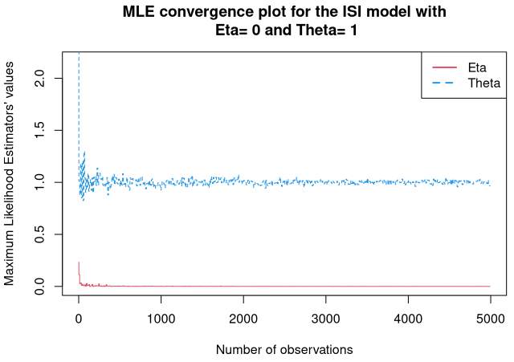

```{r setup, include=FALSE}
knitr::opts_chunk$set(echo = TRUE)
```

# Question 1

### Question 1.a

- When extracting the parameter $\theta$ from the product, $\theta$ should have been exponentiated to $n$.

- The indicator function is also impacted by the product operation resulting from computing the likelihood of several observations. The product of indicator functions $\forall i \in \{1,...,n\},\,\,\mathbb{1}_{x_i\ge\eta}$ is equal to the indicator function $\mathbb{1}_{min(X)\ge\eta}$ as any $x$ below $\eta$ implies that the whole product is null.


\begin{align}
f_i(\theta, \eta) &= \theta e^{-\theta(x_i-\eta)}\mathbb{1}_{x_i\ge\eta}\quad\text{(with $f$ the density of $X_i$)}\\
\mathcal{L}(\theta, \eta) &= \prod^n_{i=1}f_i(\theta, \eta)\\
&= \prod^n_{i=1} \theta e^{-\theta(x_i-\eta)}\mathbb{1}_{min(x_i)\ge\eta}\\
&= \theta^n e^{-\theta\sum^n_{i=1}(x_i-\eta)}\mathbb{1}_{min(X)\ge\eta}
\end{align}

### Question 1.b

Let's recall the instruction: `Simulate n = 10 i.i.d ISI with this model. For fixed theta, plot the likelihood as a function of eta.` 

The exercise meant to have a fixed true value for *both* $\theta$ and $\eta$ (but where the $\theta$ is actually known, $\eta$ would not in theory).

Then the goal was to plot a 2-dimensional graph where the x-axis would represent a range of candidates for $\eta$ and the y-axis the corresponding likelihood (for a given known $\theta$). 

In this situation, it is expected that the plot will display the maximal likelihood where the x-axis equates or gets closer to the true $\eta$.

The answer's main issue was to try generating the 10 observations using R's standard library normal distribution function `rnorm`. The actual process would have been to:

1. Generate 10 observations using the exponential distribution with true parameter $\theta$, then adding the true delay $\eta$ (The exponential function can be generated by R using the standard library function `rexp`)
2. Generate a fine, uniform sequence of candidates $\eta$ using the R standard library function $seq$
3. Map the likelihood function over that generated sequence (provided the fixed known $\theta$) to yield a likelihood at each candidate $\eta$
4. Plot the likelihood given $\eta$ graph

#### Notes
- As noted in `Question 1.a`, the likelihood function `lik` missed the exponentiation of $\theta$ in computing the variable `out`

```R
lik <- function(f_eta){
  theta<- f_eta[1] #theta
  eta<- f_eta[2]
  #out <-theta*exp(-theta*(sum(x)-length(x)*eta))
  out <- theta^n*exp(-theta*sum(x-eta))
  return(out)
}
```

### Question 1.c

#### About the MLE of $\eta$

Overall, unless a MLE is an actual constant, the estimator $\hat{\eta}$ should have been represented as a function of the observations (Wasserman, L., *All of Statistics*, p107: "*Let $T_n=g(X_1,...,X_n)$ be a statistic, that is, $T_n$ is any function of the data.*")

The trick is to see that the model's maximum likelihood for $\eta$ is very similar to the maximum likelihood definition of the lower bound parameter of a [uniform distribution](https://en.wikipedia.org/wiki/Continuous_uniform_distribution#Maximum_likelihood_estimator). The demonstration for the uniform distribution can be found on [StackExchange](https://math.stackexchange.com/questions/411145/maximum-likelihood-estimation-of-a-b-for-a-uniform-distribution-on-a-b). 

<u>Note:</u> Check the bottom right graph in the attached picture (Wasserman, L., *All of Statistics*, p125)


.

The idea is that it is the reversed problem: the likelihood is correlated to the value of the exponential distribution, and thus $\eta$ is upper-bounded by the lowest value among the observations $x_i$.

#### About the MLE of $\theta$

Besides the erroneous $\hat{\eta}$ (mentioned above) and the missing exponentiation of the first instance of the parameter $\theta$ (yielding $n\,log\,\theta$ in the log-likelihood formula), the derivation process is correct.

### Question 1.d

Similar observations as `Question 1.b` with regards to modeling ISIs: the use of a normal distribution breaks the process. One correct way to broach the question would be the following:

1. Generate a sequence of observations numbers (e.g. 10, 100, 1000, etc.) and for each number $n$:
    a. Generate $n$ observations using the exponential distribution with the true parameter $\theta$, then adding the true delay $\eta$
    b. Compute the MLE $\hat{\theta}$ and $\hat{\eta}$ and records them in an array/matrix/data.frame
2. Plot the array/matrix/data.frame of MLEs (y-axis) given the number of observations $n$ (x-axis)

This can be repeated for various true values for both $\theta$ and $\eta$. Example: 



### Question 1.e

A similar correction to the likelihood function (as mentioned in `Question 1.b`) should be applied here. 

When the concept of `time window` was mentioned in the instructions, it indicated, for instance, that a MLE for $\theta$ could have been computed on a. possibly rolling, window for instance (e.g. computing a MLE at every half-seconds; computing a MLE before and after an apparent spike, etc.)

### Question 1.f

*Not completed*

# Question 2

### Question 2.a

Everything's good. No comment.

### Question 2.b

*Not completed*

### Question 2.c

*Not completed*

### Question 2.d

*Not completed*

### Question 2.e

*Not completed*