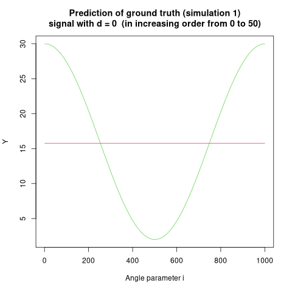
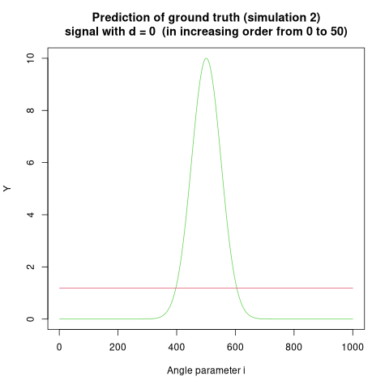
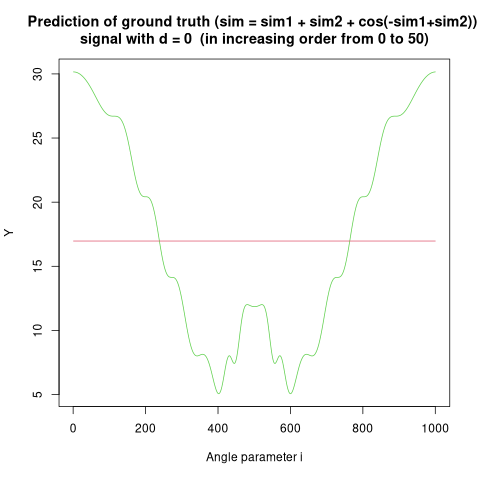

```{r setup, include=FALSE}
knitr::opts_chunk$set(echo = TRUE)
```

<hr>

## Gaussian model selection in the simplified Georgopoulos setting

**In this setting, we measure $n$ times the same cell but each time with a different angle of movement
$\forall i\in \{0,...,n-1\},\,u_i = 2\pi(\frac{i}{n})$. We decompose the regression function on a Fourier basis until size $p$ with $2p + 1 \le n$.**

<hr>

***Question 1. Create a matrix $X$ of size $n\times2p + 1$. For $u_i = 2π(\frac{i}{n})$, the coefficient $X_{i,j}$ is given as follows:***

\begin{align}
X_{i+1,j} &= 1 \text{ if } j = 1\\
X_{i+1,j} &= \cos(ku_i) \text{ if } j = 2k\\
X_{i+1,j} &= \sin(ku_i) \text{ if } j = 2k + 1
\end{align}

```{r generate_fourier_matrix}

u <- function(i, n) {2*pi*i/n}

generate_fourier_matrix <- function(n, p) {
  ### Generates a matrix of size (n, 2p+1) of fourier
  ### coefficients
  # Checks if the parameters are ill-defined
  if (2*p+1>n) {
    print("FAILED to comply with 2p+1 lesser or equal to n")
    return(NULL)
  }
  # Computes the fourier matrix
  fourier = matrix(NA, nrow=n, ncol=2*p+1)
  for (row in 1:n) {
    for (col in 1:(2*p+1)) {
      # Checks for the first column to populate with 1s
      if (col==1) {
        fourier[row, col] = 1
      } else {
        # Checks for pair-numbered columns, then populates
        if (col%%2==0){
          k = col/2
          fourier[row, col] = cos(k*u(row-1,n)) # row-1 as i starts at 0
        } else {
          k = (col-1)/2
          fourier[row, col] = sin(k*u(row-1,n))
        }
      }
    }
  }
  return(fourier)
}

```

We print an example matrix $X$ with parameters $n=10$ and $p=2$:

```{r fourier_matrix_example}

X = generate_fourier_matrix(10, 2)
round(X, 5)

```

<hr>

***Question 2. By computing the different scalar products (with R), show that the columns of $X$ are orthogonal but not of norm 1 and renormalize them: this gives you the matrix $X′$.***

```{r orthogonality_check}

check <- function(vec1, vec2) {
  ### Two vectors v1 and v2 are orthogonal if their inner 
  ### product is equal to zero
  # Rounding to account for floating point memory mgt
  round(sum(vec1 * vec2),15) == 0
}

check_length <- function(x) {
  # Check the length of unique elems in a list of two elements
  # Used to remove elems of a permutation where the same index
  # is used twice
  length(unique(x))==2
  }

check_orthogonality <- function(matrix_to_check) {
  ### Exhaustively checks for the orthogonality of each columns
  ### of a matrix with each other
  nc = dim(matrix_to_check)[2]
  # Computes all permutations of column indexes
  # not optimized, contains clones (swapped indexes)
  perms = expand.grid(c1=1:nc, c2=1:nc, stringsAsFactors=F)
  perms = perms[apply(perms, 1, check_length),]
  # Interatively checks for orthogonality
  all(apply(perms, 1,function(x) {check(
    matrix_to_check[,x[1]], matrix_to_check[,x[2]])
    }))
}

norm <- function(vec) {sqrt(sum(vec * vec))}

compute_norm_list <- function(matrix_to_check) {
  ### Computes the norm of each column of a matrix and returns
  ### the list of norms
  apply(matrix_to_check, 2, norm)
}

orthonormalize_matrix <- function(matrix_to_cast) {
  ### Divides every column vector of a matrix by its norm
  apply(matrix_to_cast, 2, function(x){x/norm(x)})
}

```

We check whether our previous example matrix $X$ has its vectors orthogonal with each other.

```{r example_orthogonality_check}

check_orthogonality(X)

```

We then check whether the column vectors of the example matrix $X$ have a norm different from 1. The respective norms of the $5$ columns are:

```{r norm_check}

compute_norm_list(X)

```

We then normalize each column vector of the example matrix $X$ by its norm, and check that the norm of each column vector of the resulting matrix $X'$ is 1.

```{r orthonormalize}

Xprime = orthonormalize_matrix(X)
compute_norm_list(Xprime)

```

We can also check whether $X'$ is orthonormal once the normalization step has been performed:

```{r orthonormal_check}

# Rounding to take into account floating point memory mgt
# QQ^t = I
round(t(Xprime)%*%Xprime, 15)

```
<hr>

***Question 3. Give, for a given $d<p$, the projection estimator of the regression function composed of the first $2d + 1$ Fourier coefficients. Transform this into a function in R.***

```{r projection_matrix}

construct_projection_matrix <- function(X, d) {
  ### Retrieves the first 2*d+1 columns of the generated fourier
  ### projection matrix
  # Checks if the parameters are ill-defined
  if (2*d+1>=dim(X)[2]) {
    print("FAILED to comply with 2d+1 <= ncols(X) (i.e. d >= p)")
    return(NULL)
  }
  # Returns the truncated projection matrix
  X[,1:(2*d+1)]
}

```

<hr>

***Question 4. Simulate two different experiments:***
\begin{align}
Y_i &= 16 + 14 \cos(u_i) + 5\epsilon_i\\
Y_i &= 10\exp(−\frac{(u_i-\pi)^2}{0.2}) + 1 * \epsilon_i\\
\text{with }\epsilon_i&\sim\mathcal{N}(0,1)\text{ (IID)}
\end{align}
***Plot the data, the true function to estimate and 4 or 5 different projection estimators in each cases. Explain the problem of overfitting and the problem of taking a model of too low dimension. NB: you can try other regression function if you want***

We decide to proceed with an example simulation with $n=1000$ (i.e. the same cell is measured $1000$ times with a different angle of movement). We arbitrarily set the factor $p$ to 200, leaving us enough space to produce 5 values $d$ such that $d\in\{1,...,p-1\}$.

We choose for $d$ the values: $2, 5, 25, 100, 150$. Our choice is oriented by wanting to display the problem of overfitting in modelling as well as when too few parameters are selected.

```{r variable_declaration}

# Sets preliminary variables
n = 1000
p = 200
d_sequence = as.matrix(c(2,5,25,50,199))

# Prints parameters of simulation
cat("Given", n, "observations for each simulation and a maximum",
    "of", p, "Fourier coefficients, we select the following",
    "amounts of coefficients to perform projection/regressions:",
    d_sequence)
```

We compute the general matrix $X'$ of the Fourier-basis regression function to be used for the rest of the exercise to compute projection estimators:

```{r projection_estimators}

# Generates the orthonormal matrix Xprime as our X matrix
X = orthonormalize_matrix(generate_fourier_matrix(n, p))

```

We can now generate the two simulations (both the base truth and acquired noisy signal):

```{r simulation_generation}

# Declares the simulation functions

generate_experiment_1 <- function(n) {
  ### Generates the simulation 1: 16+14*cos(u_i)+5*\epsilon_i
  ### We recall i \in {0, n-1}, to inform the use of seq()
  f <- function(x){16+14*cos(u(x,n))}
  truth = apply(as.matrix(seq(0,n-1,1)),1,f)
  noise = 5*rnorm(n,0,1)
  return(list("truth"=truth,"noisy_signal"=truth+noise))
}

generate_experiment_2 <- function(n) {
  ### Generates the simulation 2: 10*exp(-\frac{(u_i-\pi)^2}{0.2})
  ###                             + \epsilon_i
  ### We recall i \in {0, n-1}, to inform the use of seq()
  f <- function(x){10*exp(-(u(x,n)-pi)^2/0.2)}
  truth = apply(as.matrix(seq(0,n-1,1)),1,f)
  noise = rnorm(n,0,1)
  return(list("truth"=truth, "noisy_signal"=truth+noise))
}

# Generates the simulations
Y1 = generate_experiment_1(n)
Y2 = generate_experiment_2(n)

```

Once the data generated, we can plot the truth and its noisy channel (simulated):

```{r data_plots, out.width="100%"}

plot_simulation <- function(Y, simulation_num, legend_position=NULL, title=NULL) {
  ### Plots the simulated data with some branch check to see if 
  ### it stands alone or will be used later on for overplotting other signals
  if (is.null(legend_position)){
    colors = c("azure2", 1)
  } else {
    colors = c(3,1)
  }
  if (is.null(title)){
    title = paste("Experiment",simulation_num,"simulations")
  }
  # Plots the given data
  plot(Y$noisy_signal, type="l", col=colors[1], 
       main=title,
       xlab="Angle parameter i",
       ylab=paste("Y",simulation_num))
  lines(Y$truth, type="l", col=colors[2])
  # If required, prints the legend
  if (is.null(legend_position)==F) {
    legend(x=legend_position, 
           legend=c("Noisy channel", "Ground truth"), 
           lty=c(1,1), 
           col=colors)
  }
}

plot_simulation(Y1, 1, legend_position="bottomright")
plot_simulation(Y2, 2, legend_position="topright")

```

Based on this data, we can first compute the resulting projection estimators for the 5 values of $d$ we previously chose. We can also work back the predicted signal based on the resulting Fourier-basis regression.

```{r compute_projection_estimators}

generate_projection_estimators <- function(
  projection_matrix, signal, d, print_coeffs = T
  ) {
  ### Prints out the projection estimators given the convolution of a 
  ### Fourier-basis regression matrix with the original noisy signal
  ### Returns the retro-projection (i.e. the regression) of the original
  ### signal with the estimators
  # Computes the estimators and prints them
  estimators = signal %*% projection_matrix
  if (print_coeffs) {
    if (length(estimators) <= 10) {
      cat("Given a Fourier-basis projection matrix with", d, "coefficients, ",
          "the computed estimators are:", estimators, "\n\n")
    } else {
      cat("Given a Fourier-basis projection matrix with", d, "coefficients, ",
          "the first",round(10+d/10),"computed estimators are:", 
          estimators[1:round(10+d/10)],"\n\n")
    }
  }
  # Computes the retroprojection and returns it
  retroprojection = estimators %*% t(projection_matrix)
  return(retroprojection)
}

compute_retroprojections <- function (
  projection_matrix, signal, d_sequence, simulation_number
  ) {
  ### Computes for each d value the corresponding estimators and the retro-
  ### projection of the original noisy signal for plotting purposes
  cat("Computation for simulation Y", simulation_number,":\n")
  apply(d_sequence,1,function(d){generate_projection_estimators(
    projection_matrix[,1:(2*d+1)],
    signal,
    d
  )})
}

predicted_Y1 = compute_retroprojections(X, Y1$noisy_signal, d_sequence, 1)
predicted_Y2 = compute_retroprojections(X, Y2$noisy_signal, d_sequence, 2)

```

We now can plot the predicted signals over their original ground truth and recorded noisy channel.

```{r plot_retroprojections, out.width="100%"}

overplot_predicted_signals <- function(predictions, d_sequence, legend_position) {
  ### Based on the function plot_simulation(), overplots the predicted signals
  ### given a number of projection estimators
  # Declares legend variables
  colors = c("azure2", 1, "burlywood3", "darksalmon",
             "darkturquoise", "darkkhaki", "darkseagreen")
  names = c(c("Noisy channel", "Ground truth"), 
            c(apply(d_sequence, 1,
                    function(x){paste("Signal pred. w/ d =", x)})))
  # Computes the lines to add to a previously declared plot
  for (i in 1:dim(predictions)[2]) {
    lines(predictions[,i], type="l",col=colors[i+2], lwd=0.7)
  }
  # Adds the legend
  legend(x=legend_position, 
           legend=names, 
           lty=1, 
           col=colors,
         cex=0.7)
}

plot_simulation(Y1, 1, title="Y1 simulation with Fourier-basis predictions")
overplot_predicted_signals(predicted_Y1, d_sequence,legend_position="bottomright")
plot_simulation(Y2, 2, title="Y2 simulation with Fourier-basis predictions")
overplot_predicted_signals(predicted_Y2, d_sequence,legend_position="topright")

```

<u>Observations (the problem of **overfitting** and **underfitting**):</u>

Overfitting is the situation where training a model relies on enough parameters that it starts learning/fitting over the noise of the [training] dataset as well as the underlying ground truth.

Underfitting is the reverse situation where training a model does not have enough parameter to learn/fit the [training] dataset. There is not enough parameter in this case.

In the previous two simulations we can outline examples for those two behaviors:

- **Simulation 1** (an example of overfitting): We see that, using a Fourier basis, we do not require many Fourier coefficients (parametrized by the number $d$) to approximate the underlying ground truth (Note: this is due to the sinusoidal shape of the signal which is captured fairly well by simple fourier transforms). As such, increasing the number of Fourier coefficients by increasing the size of the projection matrix $X$ leads to overfitting as, the larger the parameter $d$, the more fitted-to-the-noise the prediction of the original signal becomes (as seen in the graph above)

- **Simulation 2** (an example of underfitting, and overfitting): We see that, using a Fourier basis, we require a high number of Fourier coefficients (parametrized by the number $d$) to approximate the underlying ground truth (further expansion on this in 'note on interpretation'). As such, increasing the number of Fourier coefficients by increasing the size of the projection matrix $X$ yields to a better approximation of the original ground truth. In opposition, a low number of Fourier coefficients (when $d$ is low) results in a failure of the fitting process, i.e. there is underfitting. However we also see that if we take in too many Fourier coefficients, we also start fitting to the noise (as seen in the graph above)

We can visualize this fitting process using the ``animation`` library from R.

*This following chunk is not run by R studio as it is formatted as a markdown quote chunk. Change it to a .Rmd code chunk to run it*

```R
#install.packages("animation")
library(animation)

plot_ground_truth_vs_pred <- function(X, signal, d, title){
  pred = compute_retroprojections(X, signal$noisy_signal, as.matrix(d), "")
  plot(signal$truth, type="l", col=3, 
         main=title,
         xlab="Angle parameter i",
         ylab="Y")
  lines(pred, type="l", col=2)
}

ani.options(interval=.25); saveGIF({for (i in 0:50){
  plot_ground_truth_vs_pred(
    X, Y1, i, paste("Prediction of ground truth (simulation 1)\nsignal with d =", 
                    i, " (in increasing order from 0 to 50)"))
}})

ani.options(interval=.25); saveGIF({for (i in 0:50){
  plot_ground_truth_vs_pred(
    X, Y2, i, paste("Prediction of ground truth (simulation 2)\nsignal with d =", 
                    i, " (in increasing order from 0 to 50)"))
}})
```

<center></center>
<center></center>

<u>Note on interpretation:</u>

The Fourier Transform is a signal decomposition method that extracts frequency and amplitude information from stationary signals while obfuscating frequency-time information.
\begin{align}
    \hat{f}(\omega)&=\underset{-\infty}{\overset{+\infty}{\int}}f(t)e^{-2\pi i \omega t}dt\\
    t&,\,\text{time}\notag\\
    \omega&,\,\text{a frequency}\notag\\
    f(t)&,\,\text{a signal intensity vs. time function}\notag
\end{align}

This obfuscation can be seen in the previous graph but by replacing the frequency-time concept with the angle parameter (which is technically parametrized by two vectors $M$ and $C$). In this situation, the Fourier Transform part of the regression allows us to either have an accurate approximation of short spikes (simulation 2) or a better resolution at larger scales. We can see this effect below:

$$Y = Y1 + Y2 + cos(-Y1+Y2)$$

We that we have a hard time fitting the ground truth using Fourier coefficients due a trade-off between capturing short spikes and wider behavior.

<center></center>

This graph could also be considered as displaying the [Gibbs phenomenon](https://en.wikipedia.org/wiki/Gibbs_phenomenon). 

<hr>

***Question 5. Make a function in R which, for a given $p$, computes the Mallow's Cp criterion for all the models ($d\le p$) and gives the estimator which minimizes the criterion. NB: the behavior would be similar for other models with - log-likelihood and AIC criterion***

We compute the best estimator given Mallow's Cp criterion for both simulation 1 and 2 given our previous parameter $p=200$.

```{r compute_mallow_cps}

compute_mallow_cp <- function(simulation, projection_matrix, d) {
  ### Computes Mallow's cp for a given d value
  preds = generate_projection_estimators(projection_matrix[,1:(2*d+1)],
                                         simulation$noisy_signal, d, 
                                         print_coeffs=F)
  penalization = var(as.vector(preds))*d
  least_square = base::norm(simulation$truth-preds, "2")
  base::norm(least_square, "2") + penalization
}

compute_mallow_cp_drange <- function(
  ### Computes Mallow's Cp over a range of d values
  simulation, projection_matrix, p, simulation_number
  ){
  if (p<0) {
    print("FAILED to comply with p >= 0 as, given d <= p, d must be positive.")
    return(NULL)
  }
  f <- function(x){compute_mallow_cp(simulation, projection_matrix, x)}
  criteria = apply(as.matrix(seq(0, p, 1)),1,f)
  cat("The best Mallow's Cp criterion for simulation", simulation_number,
      "indicates the best estimator d is: d =", which.min(criteria)-1, "\n")
  return(criteria)
}

Y1_mallowcp_criterion = compute_mallow_cp_drange(Y1, X, p,1)
Y2_mallowcp_criterion = compute_mallow_cp_drange(Y2, X, p,2)

```

We then plot the Mallow's Cp critera obtained over the whole range of $p$ (starting from 0), using the log-scale if need be.

```{r plot_mallow_cps, out.width="60%"}

plot_mallow_cps <- function(mallow_cps, title, logscale=F, max_range = NULL) {
  ### Plots the series of Mallow's Cp obtained for each d <= p
  if (is.null(max_range) == F) {
    mallow_cps = mallow_cps[0:max_range+1]
  }
  len = length(mallow_cps)-1
  if (logscale) {
    mallow_cps = log(mallow_cps)
  }
  x = as.vector(seq(0, len, 1))
  plot(x, mallow_cps, type="l", main=title, 
       col=2,
       xlab="d", ylab="Mallow's Cp")
}

plot_mallow_cps(Y1_mallowcp_criterion, "Mallow's Cp for simulation 1, given d<=p",
                logscale=T)
plot_mallow_cps(Y2_mallowcp_criterion, "Mallow's Cp for simulation 2, given d<=p",
                logscale=T)

```

We can also zoom around where the best estimators were found:

```{r compute_mallow_cps_reduced, out.width="60%"}

plot_mallow_cps(Y1_mallowcp_criterion, 
                "Mallow's Cp for simulation 1, given d = {0,...,10}",
                logscale=T, max_range=10)
plot_mallow_cps(Y2_mallowcp_criterion, 
                "Mallow's Cp for simulation 2, given d = {0,...,10}",
                logscale=T, max_range=10)

```


<hr>

***Question 6. Let us now fix $p$ and look at all the subspaces $V$ that can be written on the basis up to $2p+1$. For instance, we could have a subspace generated by $1,\cos(u),\sin(2u)$. Let us look at the BIC criterion and assume $\sigma^2$ is known. Simplify the formulas to show that this minimization problem is solved by taking as non-zeros coordinates the ones for which $|<Y |e_i>|$ is larger than $\sqrt{\ln(n)\sigma^2}$. Implement this method and show the resulting estimator on both previous cases.***

<u>Demonstration:</u>

We recall from the class that the BIC is defined as such:

\begin{align}
\hat{M} &= \underset{M\in\mathcal{M}}{argmin}\,\big[\frac{ln(n)dim(M)}{2}-lg(f_{\hat{\theta}_M}(X))\big]\\
&= \underset{M\in\mathcal{M}}{argmin}\,\big[\frac{ln(n)d}{2}-lg(f_{\hat{\theta}_M}(X))\big]
\end{align}

Using information provided online: [1](https://datacadamia.com/data_mining/bic), [2](https://en.wikipedia.org/wiki/Bayesian_information_criterion#Gaussian_special_case), [3](https://stats.stackexchange.com/questions/339126/in-bayesian-information-criterion-bic-why-does-having-bigger-n-get-penalized), [4](https://stats.stackexchange.com/questions/411820/why-is-the-bayesian-information-criterion-called-that-way), [5](https://www.statology.org/bic-in-r/), we can rework the BIC to fit the current example such that, given a fixed $n$, the number of observations, $d$ the number of parameters, and $\sigma^2$ the known variance


\begin{align}
BIC &= \frac{RSS + ln(n)d\sigma^2}{n}\\
RSS&,\,\text{the residual sum of squares}
\end{align}

<span style="color:red">TBD</span>

<hr>

Given $RSS \ge 0$ and $n$ fixed, we can restate the minimization problem of the BIC as a maximization problem such that:

$$BIC \propto ln(n)d\sigma^2-RSS$$

Given $e_i$ a vector of the subspace $V$ of the orthonormal Fourier-basis matrix $X'$, we are looking for vectors $e_i$ that maximize the BIC expression above. Given this, we can discriminate between vectors by looking for those such that $BIC \ge 0$, i.e.:

\begin{align}
BIC &\ge 0\\
ln(n)d\sigma^2-RSS &\ge 0\\
\end{align}

<hr>

<u>Computing the estimators:</u>

From the exercise's definition, we know that the true variances of Y1 and Y2 are:

\begin{align}
var(Y1)&=25\quad\text{(depends on the noise $\epsilon\sim5*\mathcal{N}(0,1)$, i.e. $\epsilon\sim\mathcal{N}(0,25)$)}\\
var(Y2)&=1\quad\text{(depends on the noise $\epsilon\sim\mathcal{N}(0,1)$)}
\end{align}

```{r BIC_best_vectors}

compute_best_vectors <- function(simulation, projection_matrix, known_var, 
                                 simulation_number) {
  ### Computes whether a given inner product of a signal and a vector e_1 is
  ### larger than a given penalization dependent on the observation size
  ### and a known variance
  f <- function(x){
    inner_product = abs(simulation$noisy_signal %*% x) 
    penalization = log(length(simulation$noisy_signal))*known_var
    inner_product >= penalization
}
  bests = which(apply(projection_matrix, 2, f))
  cat("The best vectors for the simulation", simulation_number, 
      "are the following (1-indexed):", bests)
  bests
}

Y1_best_vectors = compute_best_vectors(Y1, X, 25, 1)
Y2_best_vectors = compute_best_vectors(Y2, X, 1, 2)

```

We now have the best vectors, we can compute the estimators:

```{r BIC_retroprojection, out.width="100%"}

compute_retroprojections_2 <- function (
  projection_matrix, signal, d_sequence, simulation_number
  ) {
  ### Computes for each d value the corresponding estimators and the retro-
  ### projection of the original noisy signal for plotting purposes
  cat("Computation for simulation Y", simulation_number,":\n")
  generate_projection_estimators(projection_matrix[,d_sequence],
                                 signal$noisy_signal,
                                 paste(d_sequence, collapse=","))
}

predicted_Y1_afterBIC = compute_retroprojections_2(X, Y1, Y1_best_vectors, 1)
predicted_Y2_afterBIC = compute_retroprojections_2(X, Y2, Y2_best_vectors, 2)

plot_predicted_signals_afterBIC <- function(signal, predictions, d_sequence, 
                                            title, simulation_number,
                                            legend_position) {
  ### Plots the projection using the estimators retrieved with the BIC method
  # Declares legend variables
  colors = c("azure2", "blue", "red")
  names = c("Noisy channel", "Ground truth", 
            paste("Signal pred. w/ d = {", paste(d_sequence, collapse=","), 
                  "}"))
  # Computes the lines to add to a previously declared plot
  plot(signal$noisy_signal, type="l", col=colors[1], 
       main=title,
       xlab="Angle parameter i",
       ylab=paste("Y",simulation_number))
  lines(signal$truth, type="l", col=colors[2])
  lines(as.vector(predictions), type="l", col=colors[3])
  # Adds the legend
  legend(x=legend_position, 
           legend=names, 
           lty=1, 
           col=colors,
         cex=0.7)
}

plot_predicted_signals_afterBIC(Y1, predicted_Y1_afterBIC, Y1_best_vectors, 
                                title="Y1 signal with prediction with BIC-estimators",
                                1, "bottomright")

plot_predicted_signals_afterBIC(Y2, predicted_Y2_afterBIC, Y2_best_vectors, 
                                title="Y1 signal with prediction with BIC-estimators",
                                2, "bottomright")

```