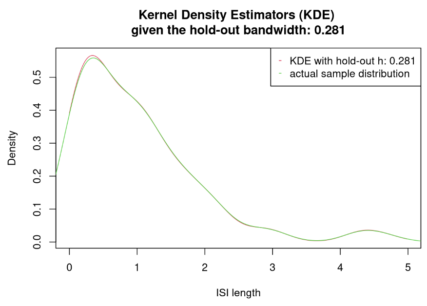
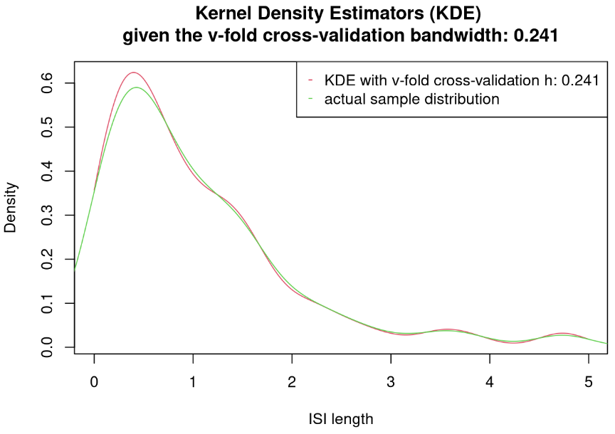
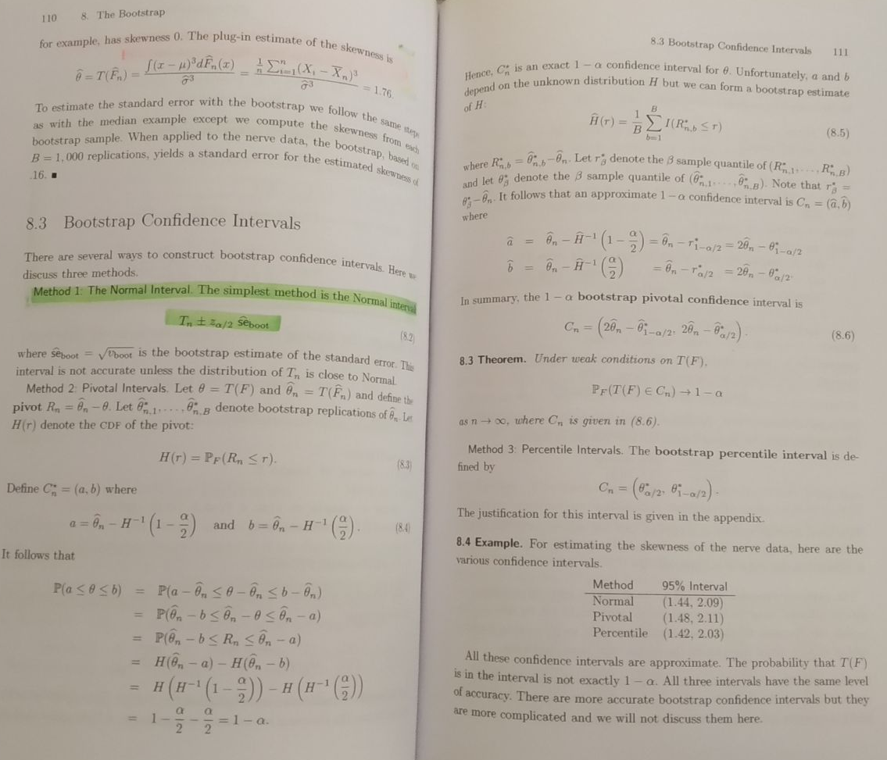

```{r setup, include=FALSE}
knitr::opts_chunk$set(echo = TRUE)
```

# 1 - Cross-Validation For Kernel Estimators

## Overview 

Given independent and identically distributed interspike intervals $X_1, ..., X_n$, let us look at the kernel estimators of an underlying density $f$. We choose $K(x)=\frac{\exp(-x^2/2)}{\sqrt{2\pi}}$. The kernel estimator with bandwidth $h$ is then defined as:
$$\hat{f}_h(u)=\frac{1}{nh}\sum^n_{i=1}K\big(\frac{u-X_i}{h}\big)$$

**A** -- Let's implement a function that computes, for a given vector $u$ and a given window $h$, the value $\hat{f}_h(.)$ for each coordinate of the vector $u$. Then let's simulate exponential variables and apply the kernel estimator with different values for $h$.

**B** -- Choosing $h$ can be done with cross-validation: Let's rely on the least-square contrast: $$C(g) = -\frac{2}{n}\sum^n_{i=1}g(X_i) + \int g(x)^2dx$$ Such that $\mathbb{E}[C(g)]$ is minimal when $f=g$ where $g$ is a candidate density. Let's demonstrate that state.

**C** -- Using the function `integrate`, let's compute the integral of the kernel estimator $f$ to the square and implement a function that computes the least square contrast on a different sample than the one previously simulated.

**D** -- Let's implement the hold-out estimator: The data is cut in half at random, half to be used for estimation, and the other half for the selection of the bandwidth parameter $h$. Then let's plot the corresponding estimator.

**E** -- Let's compare $IC_1$ and $IC_2$ for various $N$ sizes, then explain why $IC_2$ cannot converge to $IC_1$ when $N$ goes towards infinity (even if it is a pretty good approximation).

**F** -- Let's apply the previous bootstrap heuristic on the STAR-package data to show that there is a clear difference in neuron 1 (experiment `citronellal`) between the period "before the puff", "during the puff", and "after the puff" (See STAR documentation). The level of the confidence interval will be updated to account for Bonferroni correction.

## Step A

Let's declare the functions $K(.)$ and $\hat{f}_h(.)$ under the name `kernel` and `kernel_estimator` espectively:

```{r kernel_functions_declarations}

kernel <- function(x) {
  # Declares of the Gaussian kernel function K(x)
  exp(-1*x^2/2)/sqrt(2*pi)
}

kernel_estimator <- function(ISI, u, h) {
  # Declares of the kernel estimator
  # note: looks like a DFT with a sliding window
  #
  # Formats the ISI as a matrix and retrieves its length
  ISI = as.matrix(ISI); n = length(ISI)
  # Precomputes the rescale factor of the kernel estimator
  rescale_factor = 1/(n*h)
  # Computes the estimator for each u-coordinate
  f_hat = c()
  for (index in 1:length(u)) {
    kerneling = sum(apply(ISI, 1, function(x){kernel((u[index]-x)/h)}))
    f_hat = cbind(f_hat, c(rescale_factor * kerneling))
  }
  # Returns the estimator
  f_hat
}

```

Now, let's simulate a set of interspike intervals ($n=100$) via the exponential distribution using the default rate parameter $\lambda=1$. Then let's run the kernel estimator with a preselected vector $u=(0.0, 0.1,...,10.0)^T$ over the set of $h$-bandwidth parameters $\{0.1, ..., 0.5\}$.

```{r isi_simulation_and_kerneling}

# Declares parameters
n = 100
u_stepsize = 0.01
u = seq(0, 9.99, u_stepsize)
h = as.matrix(seq(0.05, 0.5, 0.05))

# Simulates interspike intervals
ISI = rexp(n, rate=1)

# Computes the kernel estimator for each h
estimators = apply(h, 1, function(x) {kernel_estimator(ISI, u, x)})

# Declares the end data.frame holding the estimators
names_col = apply(h, 1, function(x){paste("h_",x,sep="")})
estimators = as.data.frame(estimators, row.names=u)
estimators = setNames(estimators, names_col) # naming cols within as.d.f fails for me

```

Let's display the resulting estimators over the preselected range of $h$ bandwidths, given the vector $u$ and the randomly generated interspike intervals.

```{r print_kernel_estimators}

head(estimators)

```

Now, let's visualize the resulting kernel densities, truncated to the first half length of the range/vector $u$:

```{r visualize_kernel_estimators, out.width="100%"}

plot_kde <- function(kernel_estimates, range_to_plot=c(1:500)){
  # Plots the KDE collected in a given data.frame
  plot(u[range_to_plot], kernel_estimates[range_to_plot,1], 
       type="l", col=2, ylab="Density", xlab="ISI length",
       main="Kernel Density Estimators (KDE) given five bandwidths h")
  for (cl in 2:dim(kernel_estimates)[2]) {
    lines(u[range_to_plot], kernel_estimates[range_to_plot,cl], 
          type="l", col=cl+1)
  }
  legend("topright", legend=colnames(kernel_estimates), 
         col=c(2:(dim(kernel_estimates)[2]+1)), pch="-")
}

plot_kde(estimators)

```

## Step B

Let's set the least-square contrast for density $C$ such that:
\begin{align}
\forall i \in \{1, ..., n\}&,\,X_i\sim f,\,\text{ IID}\\
g&,\,\text{ a candidate density}\\
C(g) &= -\frac{2}{n}\sum^n_{i=1}g(X_i) + \int g(x)^2dx
\end{align}

As such, the expectation of $C$ with $g$ a candidate density is:

\begin{align}
\mathbb{E}_{\forall i \in \{1, ..., n\},\,X_i\sim f}\big[C(g)\big]&=\mathbb{E}\big[-\frac{2}{n}\sum^n_{i=1}g(X_i) + \int g(x)^2dx\big]\\
&=-\frac{2}{n}\sum^n_{i=1}\int g(x)f(x) dx + \int g(x)^2dx\\
&=-2\int g(x)f(x) dx + \int g(x)^2dx\\
&=\int (g(x)-f(x))^2 dx - \int f(x)^2dx
\end{align}

Given that $\int f(x)^2dx$ is a constant, $\mathbb{E}_{\forall i \in \{1, ..., n\},\,X_i\sim f}\big[C(g)\big]$ is minimal when $\int (g(x)f(x))^2 dx$ is minimal. As such, it is demonstrable that:

\begin{align}
\int (g(x)-f(x))^2 dx&\ge0\\
\int (g(x)-f(x))^2 dx&=0\text{ if and only if }\forall x,\,g(x)-f(x)=0\\
\end{align}

It can be concluded that $\mathbb{E}[C(g)]$ is minimal when the candidate density $g$ is equal to the density $f$ given $\forall i \in \{1, ..., n\},\,X_i\sim f,\,\text{ IID}$.

## Step C

Let's build the function implementing $C(f)$ such that: $$C(f) = -\frac{2}{n}\sum^n_{i=1}f(X_i) + \int f(x)^2dx$$

The integral part can be computed by reusing the previously declared function `kernel_estimator`. Let's also pre-emptively create a contrast function that can handle a train and a validation/test sets for the next steps D and E. 

```{r constrast_function_declaration}

integrate_kde <- function(kde) {
  # Integrates a kde function over its support (here R_+)
  integrate(Vectorize(kde), 
            lower=0, upper = Inf, 
            subdivisions=5000)
}

contrast_least_squares <- function(ISI_train, u, u_stepsize, h, ISI_test=NULL){
  # Declares the least-square contrast function
  # 
  # Formats the ISI as a matrix and retrieves its length
  ISI_train = as.matrix(ISI_train)
  if (!is.null(ISI_test)) {
    ISI_test = as.matrix(ISI_test); n = length(ISI_test)
  } else {
    ISI_test = as.matrix(ISI_train); n = length(ISI_train)
  }
  # Computes the kernel estimators and the corresponding KDE
  estimators = kernel_estimator(ISI_train, u, h)
  # Declares useful functions to compute the densities
  na_check <- function(x) {if (is.na(x) || is.null(x)) {-Inf} else {x}}
  support_check <- function(x) {if (x < min(u) || x > max(u)) {T} else {F}}
  kde <- function(x) {
    if (support_check(na_check(x))) {
      0
    } else {
      x = as.vector(estimators)[round(x/u_stepsize)]
      if (length(x)==0 || is.na(x)) {0} else {x}
    }
  }
  kde_squared <- function(x) {kde(x)^2}
  # Computes the relative likelihood of each X given the computed
  # Kernel Density Estimation
  densities = apply(ISI_test, 1, kde)
  # Computes the corresponding integral of the kernel estimator
  integration = integrate_kde(kde_squared)
  #cat(paste("Integration result: ", integration,"\n"))
  # Computes and return the contrast
  contrast = -1*2/n*sum(unlist(densities), na.rm=T) + integration$value
  contrast
}

```

Now, let's generate a new sample, drawn from the same exponential distribution as previously stated. Let's also update the support for the bandwidth parameters $h$ so as to have a finer parameter grid. The sample size is increased from 100 to 1000.

```{r isi_simulation_2}

# Updates parameters
h = as.matrix(seq(0.01, 0.5, 0.01))
n = 100

# Simulates interspike intervals
ISI = rexp(n, rate=1)

```

Reusing the previous parameters, the contrast for the newly simulated ISI can be computed:

```{r compute_contrast, out.width="100%"}

# Declares parameter
u_stepsize = 0.01
u = seq(0., 5., u_stepsize)
h = as.matrix(seq(0.001, 0.51, 0.02))

# Computes the resulting contrasts
contrasts = apply(h,1,function(x) {
  contrast_least_squares(ISI, u, u_stepsize, x)
})

# Plots the given contrasts for the set of bandwidths h
plot(h, contrasts, type="l",
     xlab="Bandwidth Parameter h", ylab="Contrast",
     main="Least-Square Contrast on a Exponential distribution Exp(1)")

```

The lowest contrast was achieved on the new simulation of the exponential distribution $\mathcal{E}(1)$ with the bandwidth parameter $h$ set to:

```{r best_h}

best_h = h[which(contrasts==min(contrasts))]
best_h

```

With this bandwidth value, let's compare the kernel estimator's resulting distribution against the actual sample distribution.

```{r kde, out.width="100%"}

# Declares the plotting function
plot_kde_vs_sample_dist <- function(estimator, ISI, best_h, val_method=""){
    # Plots the KDE collected in a given data.frame
  range_to_plot = 1:500
  plot(u[range_to_plot], estimator[range_to_plot], 
         type="l", col=2, ylab="Density", xlab="ISI length",
         main=paste("Kernel Density Estimators (KDE)",
                    "\ngiven the", val_method, "bandwidth:",best_h))
  lines(density(ISI), type="l", col=3)
  legend("topright", legend=c(paste("KDE with", val_method, "h:",best_h),
                              "actual sample distribution"), col=c(2, 3), 
         pch="-")
}

# Computes the kernel estimates again with the selected h
estimator = kernel_estimator(ISI, u, best_h)

# Plots the distribution
plot_kde_vs_sample_dist(estimator, ISI, best_h)

```

It is evidenced that the resulting bandwidth parameter $h$ does not specifically help fit the actual distribution. A better way to determine which $h$ is the best is needed. This will be looked at in the next step with hold-out and cross-validation.

## Step D

In order to perform hold-out validation, let's start with implementing the data processing pipeline for the hold-out estimator.

```{r holdout_validation_process}

dataset_split_holdout <- function(dataset) {
  # Implements a hold-out dataset splitting function. It 
  # randomly split the input data into two equal-length subsets.
  n = length(dataset)
  split_point = round(n/2)
  scrambled_data = sample(dataset)
  return(list(
    "train"=scrambled_data[1:split_point],
    "test"=scrambled_data[(1+split_point):n])
  )
}

sets = dataset_split_holdout(ISI)

```

With both training and validation/test sets, let's run the same process as before:

```{r compute_contrast_hold_out, out.width="100%"}

# Computes the resulting contrasts
contrasts = apply(h,1,function(x) {
  contrast_least_squares(sets$train, u, u_stepsize, x, sets$test)
})

# Plots the given contrasts for the set of bandwidths h
plot(h, contrasts, type="l",
     xlab="Bandwidth Parameter h", ylab="Contrast",
     main="Least-Square Contrast on a Exp. distribution Exp(1)\nwith Hold-Out Validation")

```

After hold-out validation, the lowest contrast was achieved on the simulation of the exponential distribution $\mathcal{E}(1)$ with the bandwidth parameter $h$ set to:

```{r best_h_hold_out}

best_h = h[which(contrasts==min(contrasts))]
best_h

```

With the current best parameter $h$ given the hold-out validation, let's compute and plot the kernel estimator again based on it:

```{r hold_out_kde, out.width="100%"}

# Computes the kernel estimates again with the selected h
estimator = kernel_estimator(ISI, u, best_h)

# Plots the distribution
plot_kde_vs_sample_dist(estimator, ISI, best_h, val_method="hold-out")

```

## Step E

In order to implement our cross-validation, let's implement a specifically-designed loop function to iterate over both the available data and the set of possible bandwidth parameters $h$.

```{r v_fold_validation_process}

v_fold_cross_validation <- function(ISI, h, v, u, u_stepsize) {
  # Implements a v-fold cross-validation process over a ISI dataset
  # in order to find the best bandwidth parameter h out of a candidate list
  #
  # Creates v-folds out of the input ISI dataset
  n = length(ISI)
  folds = split(ISI,ceiling(seq_along(ISI)/round(length(ISI)/v)))
  contrasts = c()
  for (test_fold in 1:v) {
    # Computes the data to be used for training and for testing
    train_folds = c(1:v)[c(1:v)!=test_fold]
    train_ISI = as.vector(unlist(folds[train_folds]))
    test_ISI = as.vector(unlist(folds[test_fold]))
    # Computes the contrasts for each fold pass
    contrast = apply(h,1,function(x) {
      contrast_least_squares(train_ISI, u, u_stepsize, x, test_ISI)
    })
    # Records the computed contrats
    contrasts = cbind(contrasts, contrast)
  }
  1/v*apply(contrasts,1,sum)
}

```

With a number of folds to $10$, let's compute and visualize the V-fold Cross-Validation:

```{r v_fold_computation, out.width="100%"}

# Declares v
v = 10

# Computes the v_fold_contrasts
v_fold_contrasts = v_fold_cross_validation(ISI, h, 10, u, u_stepsize)

# Plots the given contrasts for the set of bandwidths h
plot(h, v_fold_contrasts, type="l",
     xlab="Bandwidth Parameter h", ylab="Contrast",
     main="Least-Square Contrast on a Exp. distribution Exp(1)\nwith V-Fold Cross-Validation")

```

After v-fold cross-validation, the lowest contrast was achieved on the simulation of the exponential distribution $\mathcal{E}(1)$ with the bandwidth parameter $h$ set to:

```{r best_h_v_fold}

best_h = h[which(v_fold_contrasts==min(v_fold_contrasts))]
best_h

```

With the current best parameter $h$ given the hold-out validation, let's compute and plot the kernel estimator again based on it:

```{r v_fold_kde, out.width="100%"}

# Computes the kernel estimates again with the selected h
estimator = kernel_estimator(ISI, u, best_h)

# Plots the distribution
plot_kde_vs_sample_dist(estimator, ISI, best_h, val_method="v-fold cross-validation")

```

### Note on Step D and E

It is observed that, by visual inspection of the plots, the estimations with the hold-out and v-fold cross-validation perform better than the first method (which did not use validation). 

In the current implementation, it seems that the hold-out method tends to provide an equivalent or better estimation than v-fold cross-validation (i.e. with this specific selection of $h$ bandwidth and $u$ range, hold-out seems to offer a better $h$ in general). 

However, by running the above process several times, it happens that the hold-out and v-fold cross-validation methods can find very fitting approximations (*though not always during the same simulation*), which are very close to the actual sample density:





# 2 - Parametric Bootstrap

## Overview 

Let's implement parametric bootstrap.

**A** -- Let's simulate $n = 50$ exponential variables with parameter $\theta_0 = 2$. This will be considered as observations.

**B** -- Let's compute the Maximum Likelihood Estimator (MLE) $\hat{\theta}_{obs}$ of $\theta$ for $n=50$ IID ISI modeled by an exponential distribution.

**C** -- By simulating $N_simu = 10000$ times $n$ exponential variables with parameter $\theta_0 = 2$, let's compute an approximate classical confidence interval $IC_1$ on 4\theta$ with confidence $95\%$.

<u>Of note:</u> To do that, one can for instance compute $D_i = |\hat{\theta}_i − \theta_0 |$ on each simulation and decide that, with a c. $95\%$ probability, the distance between $\hat{\theta}$ and $\theta_0$ is less than the $95\%$ empirical quantile of $D_i$. this cannot be done on real data since $\theta_0$ is not known.

**D** -- By bootstrapping the data the parametric approach, let's compute a bootstrap confidence interval IC2. To do so, $n$ exponential variables are simulated $N$ times with parameter $\theta = \hat{\theta}$ and do as before with respect to the simulation.

**E** -- Let's compare $IC_1$ and $IC_2$ for various size of $N$. Let's also explain why $IC_2$ cannot converge to $IC_1$ when $N\rightarrow+\infty$, even if it is a pretty good approximation.

## Step A

```{r parametric_bootstrap_simulation}

# Declares parameters
n = 50
theta_0 = 2

# Simulates
observations = rexp(n, theta_0)

```

## Step B

The parametric approach informs that the MLE for IID ISI modeled by an exponential distribution is the following: $\hat{\theta}_{obs}=\frac{1}{\bar{X}}$ with $\bar{X}$ the sample mean of the observations. The proof can be found here: [StatLect](https://www.statlect.com/fundamentals-of-statistics/exponential-distribution-maximum-likelihood) (last accessed, Dec 5, 2021).

```{r parametric_bootstrap_MLE}

hat_theta_obs <- function(observations){
  # Computes the MLE of observations following an exponential distribution
  1/(mean(observations))
}

# Computes and prints the MLE of the generated 50 observations
hat_theta = hat_theta_obs(observations)
hat_theta

```

## Step C

Let's compute the $95\%$ confidence interval $IC_1$ of $\theta$. To do that, $IC_1$ is derived by preliminarilly computing the $95\%$ quantile of $D$: $$\forall i\in\{1, ..., n_{simulations}\},\,\,D_i = |\hat{\theta}_i − \theta_0 |$$.

```{r parametric_bootstrap_D}

compute_distances <- function(N, n, theta_0) {
  # Computes the MLE of each simuation
  hat_theta_sims = apply(matrix(1:n_simulations), 1, 
                         function(x) {hat_theta_obs(rexp(n, theta_0))})
  # Computes the difference/distance between each MLE and the 
  # real parameter theta_0
  abs(theta_0-hat_theta_sims)
}

# Declares variables
n_simulations = 10000

distances = compute_distances(n_simulations, n, theta_0)

```

With $D_i, \forall i\in\{1, ..., n_{simulations}\}$, the distribution of $D$ can be plotted for visualization purposes:

```{r parametric_bootstrap_Ddistribution, out.width="100%"}

plot(density(distances), xlab="", ylab="",
     main="Distribution of the distances of theta_hat to theta_0")

```

Let's compute the $95\%$ quantile of $D$ and can rework the $95\%$ confidence interval on $\theta$. 

```{r parametric_bootstrap_IC1}

compute_95CI <- function(distances, theta_0, print_msg=F) {
  # Computes the 95% quantile of D
  quantile95_distances = quantile(distances, probs=c(0.95))
  # Computes and prints the resulting CI1 of theta
  CI = c(theta_0-quantile95_distances, theta_0+quantile95_distances)
  CI = t(as.matrix(setNames(CI, c("2.5%", "97.5%"))))
  if (print_msg) {
    cat("The classical 95% confidence interval for theta is:\n", CI)
  }
  CI
}

IC = compute_95CI(distances, theta_0, T)

```

## Step D

Let's reuse the content used in steps A and B for the following steps. To perform the parametric bootstrapping, the number of simulation is arbitrarily set to $N=10000$, as with Step C.  

```{r parametric_bootstrap_IC2}

# Declares or recalls the parameters
N = 10000
n= 50

# Declares the bootstrap version of compute_distances
compute_distances_bootstrap <- function(N, n, observations) {
  # Computes the MLE of each simuation
  hat_theta_sims = apply(matrix(1:n_simulations), 1, 
                         function(x) {hat_theta_obs(
                           sample(observations, n, replace=T)
                         )})
  # Computes the difference/distance between each MLE and the 
  # real parameter theta_0
  abs(theta_0-hat_theta_sims)
}

# Substitutes our previously computed hat_theta for theta_0 in the 
# previously declared function setup
distances = compute_distances_bootstrap(n_simulations, n, observations)
IC2 = compute_95CI(distances, hat_theta, T)

```

## Step E

Let's reuse the previous process, varying $N$ from $10$ to $1e12$ by orders of magnitude.

```{r parametric_bootstrap_IC1vIC2}

# Declares the range for N_simulations
N_range = matrix(apply(matrix(1:12), 1, function(x){10^x}))

# Declares the composition function to compute CIs
compute_ci <- function(n_simulations, n, theta, observations, bootstrap=F) {
  if (bootstrap) {
    compute_95CI(compute_distances_bootstrap(n_simulations, n, observations), theta)
  } else {
    compute_95CI(compute_distances(n_simulations, n, theta), theta)
  }
}

# Computes the CI1 and CI2 for the given N range
cis = apply(N_range, 1, function(x){c(compute_ci(x, n, theta_0),
                                      compute_ci(x, n, hat_theta, observations, T))})
cis = t(cis)
row.names(cis) = N_range
colnames(cis) = c("CI1_0.025","CI1_0.975","CI2_0.025","CI2_0.975")
cis

```

Let's compute the difference between $CI_1$ and $CI_2$'s confidence interval lower and upper bounds. Those differences are then plotted:

```{r r parametric_bootstrap_IC1vIC2_2, out.width="100%"}

differences = c(cis[,3]-cis[,1], cis[,4]-cis[,2])
differences = matrix(differences, ncol=2)

plot(differences[,1], 
     ylim = c(min(differences), max(differences)+abs(0.25*max(differences))), 
     type="l", col=2, xaxt="n", ylab="difference between CI1 and CI2",
     xlab="Number of simulations for bootstrapping")
axis(1, at=c(1:12), labels=as.vector(N_range))
lines(differences[,2], type="l", col=3)
legend("topright", legend=c("CI 0.025% threshold", "CI 0.975% threshold"),
       col=c(2,3), pch="-")

```

It is evidenced that there is no apparent convergence of the two confidence intervals. 

This is due to the theory of the bootstrap pivotal confidence interval (See picture from *All of Statistics*, by L. Wasserman, p111) that states that the boostrap confidence interval will converge towards that given interval $C_n$, but that confidence interval is not the original (but is close). Working with bootstrapped values, the underlying distribution is not $\exp(\theta_0)$ but the bootstrapped one, which is never exactly the same.



## Step F

```{r STAR_reqs, results=FALSE,  message=FALSE}

#install.packages("STAR")
library(STAR)

```

Let's import the data:

```{r puff_data_import, out.width="100%"}

data(e070528citronellal)
neuron_1 = e070528citronellal[["neuron 1"]]

plot(neuron_1)

```

Given prior knowledge, the periods characterizing the behavior of the neuron are defined as such:

- Before the puff: $t\in[0, 6.14]$
- During the puff: $t\in]6.14, 6.64[$
- After the puff: $t\in[6.64, c. 13]$

Let's retrieve the 15 simulations' spike data into three sets as vectors.

```{r puff_data_extraction}

spike_data_extract <- function(neuron_data, lower=NULL, upper=NULL){
  # Extracts spike data in a given time frame and return
  # the corresponding ISI
  ISI=c()
  for (sim in 1:length(neuron_data)){
    sim_spikes = as.vector(neuron_1[[sim]])
    if (is.null(lower)){
      indexes = which((sim_spikes>=upper))
    } else if (is.null(upper)) {
      indexes = which((sim_spikes<=lower))
    } else {
      indexes = which((sim_spikes>lower)&(sim_spikes<upper))
    }
    ISI = c(ISI, diff(sim_spikes[indexes]))
  }
  return(list("ISI"=ISI, 
              "theta_hat"=1/(mean(ISI)-min(ISI))))
}

# Retrieves the data per period
data_before = spike_data_extract(neuron_1, 6.14, NULL)
data_during = spike_data_extract(neuron_1, 6.14, 6.65)
data_after  = spike_data_extract(neuron_1, NULL, 6.65)

```

Let's plot the extracted datasets against each other:

```{r ISI_distributions, out.width="100%"}

plot(density(data_during$ISI), type="l", col=2, xlab="ISI", ylab="",
     "Distribution of ISI dependent on the timeframe")
lines(density(data_before$ISI), type="l", col=3)
lines(density(data_after$ISI), type="l", col=4)
legend("topright", legend=c("During Puff", "Before Puff", "After Puff"),
        col=c(2,3,4),pch="-")

```

It is visually verifiable that there is a discrepancy between the distributions. To show that statistically, let's first start by declaring the following functions:

```{r functions_CI_with_bonferroni}

compute_distances_bootstrap_bonferroni <- function(N, observations, theta) {
  # Computes the MLE of each simuation
  hat_theta_sims = apply(matrix(1:n_simulations), 1, 
                         function(x) {hat_theta_obs(
                           sample(observations, n, replace=T)
                         )})
  # Computes the difference/distance between each MLE and the 
  # real parameter theta_0
  abs(theta-hat_theta_sims)
}

compute_95CI_bonferroni <- function(distances, theta, k_tests, print_msg=F) {
  # Computes the 95% quantile of the distances between a boostrapped sample
  # of ISI, given a Bonferroni correction
  quantile95_distances = quantile(distances, probs=c(1-0.5/k_tests))
  # Computes and prints the resulting CI1 of theta
  CI = c(theta-quantile95_distances, theta+quantile95_distances)
  CI = t(as.matrix(setNames(CI, c("2.5%", "97.5%"))))
  if (print_msg) {
    cat("The classical 95% confidence interval",
        "with Bonferroni correction for theta is:\n", CI,"\n")
  }
  CI
}

```

Let's now compute the 95% confidence interval with Bonferroni correction. Here the number of tests of level $\alpha=0.05$ is $3$ since one confidence interval per dataset (before, during, after) is computed. For the bootstrapping, let's reuse the previous number of simulations $N=10000$.

```{r compute_CI_with_bonferroni}

N=10000

distances = compute_distances_bootstrap_bonferroni(N, data_before$ISI, data_before$theta_hat)
ICbefore = compute_95CI_bonferroni(distances, data_before$theta_hat, 3, T)

distances = compute_distances_bootstrap_bonferroni(N, data_during$ISI, data_during$theta_hat)
ICduring = compute_95CI_bonferroni(distances, data_during$theta_hat, 3, T)

distances = compute_distances_bootstrap_bonferroni(N, data_after$ISI, data_after$theta_hat)
ICafter = compute_95CI_bonferroni(distances, data_after$theta_hat, 3, T)

```

As such, it is evidenced that there is a clear distinction between the "before" and "after" periods and the "during" period as they do not overlap. Similarly, it is uncertain whether or not the "before" and "after" periods are distinct in terms of behavior as their confidence interval do overlap.

# 3 - Non-Parametric Boostrap

## Overview 

Reusing the previous data of the STAR package, let's perform non-parametric bootstrap (with firing rates instead of ISI). Let's compute to compute non parametric bootstrap confidence intervals on the firing rates. A firing rate is defined by the average number of spikes per second.

**A** -- Let's compute an estimation of the firing rate for each of the three periods for the experiment `citronellal` and for each of the trials.

**B** -- Let's code a function for computing the bootstrap confidence interval on the mean at a given level $\alpha$. Then let's test it on simulated data to see if it works.

**C** -- Let's apply it on the estimated firing rates of each period in **A** and see if it can be concluded non-parametrically on a difference between the three periods in terms of firing rates.

## Step A

To compute an estimation of the firing rate, let's take the average firing rate per second over each of the three periods outlined in the previous section. 

Let's first declare the corresponding function:

```{r firing_rates_function}

firing_rate_extract <- function(neuron_data, lower=NULL, upper=NULL){
  # Extracts spike data in a given time frame and return
  # the corresponding ISI
  #
  # Data extraction function
  spike_extract <- function(sim){
    sim_spikes = as.vector(neuron_1[[sim]])
    if (is.null(lower)){
      indexes = which((sim_spikes>=upper))
    } else if (is.null(upper)) {
      indexes = which((sim_spikes<=lower))
    } else {
      indexes = which((sim_spikes>lower)&(sim_spikes<upper))
    }
    sim_spikes[indexes]
  }
  # Extracts the spike data
  spikes=c()
  n_simulations = as.matrix(c(1:length(neuron_data)))
  spikes = apply(n_simulations, 1, spike_extract)
  # Computes the firing rate for each of the 3 periods and 15 simulations
  firing_rates = apply(n_simulations, 1, 
                       function(x){
                         length(spikes[[x]])/(max(spikes[[x]])-min(spikes[[x]]))
                      })
  return(list("spikes"=spikes, 
              "firing_rates"=firing_rates))
}

```

Let's extract the data and compute the corresponding firing rates.

```{r firing_rates_computation}

data_before = firing_rate_extract(neuron_1, 6.14, NULL)
data_during = firing_rate_extract(neuron_1, 6.14, 6.65)
data_after  = firing_rate_extract(neuron_1, NULL, 6.65)

```

With the firing rate computed, let's visualize them for each simulation.

```{r firing_rates_visualization, out.width="100%"}

plot(data_before$firing_rates, pch="+",
     ylim=c(0,max(data_during$firing_rates)+10), col=2,
     xlab="Experiment number", ylab="Recorded firing rate",
     main=paste("Firing rate during each period for all experiments", 
                "\non Neuron 1 (citronellal)")
)
points(data_during$firing_rates, pch="+", col=3)
points(data_after$firing_rates, pch="+", col=4)
legend("topright", legend=c("Before Puff", "During Puff", "After Puff"),
        col=c(2,3,4),pch="+")

```

## Step B

Let's build a non-parametric bootstrap function for the mean confidence interval:

```{r non_param_bootstrap_function}

mean_CI_bootstrap <- function(data, n_simulations, alpha, print_msg=F) {
  # Performs a bootstrap of the mean of a given data
  #
  # Computes preliminary parameters
  n = length(data)
  sample_mean = mean(data)
  # Bootstraps the data with unknown mean
  bootstrapped_data = t(apply(
    matrix(c(1:n_simulations)), 1,
    function(x) {sample(data, n, replace=T)}
  ))
  # Computes a sample mean for each bootstrapped sample
  bootstrapped_means = apply(bootstrapped_data, 1, mean)
  # Computes the distance between bootstrapped means and sample mean
  bootstrapped_dists = bootstrapped_means - sample_mean
  # Computes the bootstrapped confidence interval at level 1-alpha
  q_alpha_div_2 = quantile(bootstrapped_dists, prob=c(alpha/2))
  q_1_plus_alpha_div_2 = quantile(bootstrapped_dists, prob=c(1-alpha/2))
  CI = c(sample_mean+q_alpha_div_2, sample_mean+q_1_plus_alpha_div_2)
  # Prints result
  if (print_msg) {
    cat(paste("The", (1-alpha)*100, "% bootstrapped confidence interval for the",
              "given data is:\n"))
  }
  # Returns
  CI
}

```

Let's generate a normal distribution with 10 elements with mean $\mu=0$ and standard deviation $\sigma=1$, and compute its $95\%$ bootstrapped confidence interval for the mean with $N_{simulation}=10000$ as an example:

```{r bootstrap_meanCI_simulated_data}

n_simulations = 10000
data = rnorm(10, 0, 1)
mean_CI_bootstrap(data, n_simulations, 0.05, print_msg=T)

```

It is shown that the real mean $\mu=0$ falls into the bootstrapped confidence interval for the mean.

## Step C

Let's compute a $95\%$ bootstrapped confidence interval for the mean of each period, with $N_{simulation}=10000$. 

```{r bootstrap_meanCI_neuron_data}

mean_CI_bootstrap(data_before$firing_rates, n_simulations, 0.05, print_msg=T)

mean_CI_bootstrap(data_during$firing_rates, n_simulations, 0.05, print_msg=T)

mean_CI_bootstrap(data_after$firing_rates, n_simulations, 0.05, print_msg=T)

```

The resulting $95\%$ confidence intervals tend to not overlap with each other (Note: in few cases the confidence intervals for the means before and after the puff overlap at their respective upper and lower bounds). this indicates that there is a difference between the three periods in terms of firing rates.

# 4 - Clustering

## Overview 

86 neurons of the striatum of a rat performing a spatial task have been recorded. The attached file `action_potential.Rdata` contains the average shape of their action potential as recorded by tetrodes. Typing `load(action_potential.Rdata)` will provide a variable `Record` (a list). `Record[[i]]` is a matrix with 32 lines and 86 columns (one column=one neuron), the index $i$ refers to the electrode number $i$ of the tetrode. The line $j$ in the matrix corresponds to the value of the action potential at $j ∗ 0.0001$ second after the beginning of the action potential.

**A** -- Let's plot for some neurons the superposition of the 4 forms that are corresponding to the action potential as seen by each of the electrodes. It will be shown that the heights of the signal are very differents. This comes from the proximity of the electrodes. IT will also be shown that the highest signal is not always recorded by the same electrode.

**B** -- Let's focus on the best shape, i.e., the shape with the highest peak on all electrodes. On this curve, let's extract two parameters for each neurons, representing the action potential: the duration of the peak above half its height, the delay between the time of the valley after the peak and the time of the peak.

**C** -- Before doing hierarchical clustering, let's center and renormalize both quantities (as when doing PCA) and put the result into a matrix $x$ with 2 columns and 86 rows. Then, let's use `plot(hclust(dist(x),method="ward.D2"))` to see the dendogram. Let's find the largest distance between clusters and cut the tree there. Then let's that there clearly are two clusters.

<u>Of note:</u> *The dendrogram is a visual representation of the data. The two closest points are merged together and represented by their middle (or barycenter) then the algorithm continue and can eventually merge points and barycenters, or two barycenters together until everything is merged. This process of merging is plot as a tree: when two quantities with different heights are merged there are new branches growing and the shortest one correspond to the distance between the centers.*

**D** -- The commands `z=kmeans(x,2)` and `z$cluster` give the cluster label for the different neurons. Let's plot the neurons in the plane of the two variables with a different color code for the first cluster and second cluster as estimated by k-means. this way, "fast spiking interneurons" (the ones with small durations for each delays) and the "medium spiny neurons" have been identified.

## Step A

Let's start by importing the data:

```{r action_potential_import}

load("./data/action_potential.Rdata")
action_potentials = Record

cat(paste("Number of electrodes in the tetrode available:", length(action_potentials)))
cat(paste("Number of neurons available:", dim(action_potentials[[1]])[2]))
cat(paste("Number of recorded action potential timesteps available per neuron:", 
          dim(action_potentials[[1]])[1]))

```

Once the data is imported, let's declare a plotting function to plot selections of neurons from the available data (acquired via each electrode).

```{r electrode_neuron_plot_function}

plot_neuron_data <- function(neuron_number, action_potentials, print_plot=T) {
  # Given a neuron number/index, fetches the corresponding action potential
  # data recorded by each of the four available electrodes and plots the results
  electrode_indexes = matrix(1:4)
  # Retrieves the neuron data recorded by each electrode
  AP_data = apply(electrode_indexes, 1, 
                  function(x) {action_potentials[[x]][,neuron_number]})
  AP_data = as.data.frame(AP_data, row.names=c(1:32))
  AP_data = setNames(AP_data, c("electrode_1", "electrode_2", "electrode_3", "electrode_4"))
  # Plots the retrieved data if indicated, if print_plot=F, the function
  # only returns the data
  if (print_plot){
    plot.ts(AP_data,cex.lab=0.8, 
            main=paste("Neuron", neuron_number, "'s AP, as recorded",
                       "by the tetrode's 4 electrodes"))
  }
  # Returns the retrieved data
  return(AP_data)
}

```

Let's select four random neurons and plot their action potentials with the previously declared functions.

```{r plot_neuron_action_potentials, out.width="100%"}

neuron_numbers = sample(c(1:dim(action_potentials[[1]])[2]), 4, replace=F)
for (i in neuron_numbers) {
  data = plot_neuron_data(i, action_potentials)
}

```

To see which electrode recorded the highest signal for each neuron, let's extract the whole data into a single dataframe.

```{r find_highest_signal}

# Retrieves all neurons' AP for all electrodes
full_data = apply(matrix(1:86), 1, function(x) {
                    plot_neuron_data(x, action_potentials, print_plot=F)})

find_electrode_with_highest_signal <- function(full_data){
  # Computes, for each neuron, the electrode that recorded the highest signal
  neuron_indexes = matrix(1:length(full_data))
  apply(neuron_indexes, 1, function(x) {
    round((which(as.matrix(full_data[[x]])==max(full_data[[x]])))/32+1)})
}

# Computes the electrode with the best record per neuron
best_electrodes = find_electrode_with_highest_signal(full_data)
best_electrodes = matrix(best_electrodes, nrow=length(full_data))
row.names(best_electrodes) = c(1:length(full_data))
colnames(best_electrodes) = c("electrode_with_best_record")

```

We now visualize the results:

```{r visualize_highest_signals}

table(best_electrodes)

```

In the end, it is found that the electrodes 2 and 3 recorded the highest signal the most, while the electrode 4 recorded the highest signal the least amount of time among the 86 neurons.

## Step B

Let's create a function to output the vector $(\text{peak_to_valley_length}, \text{peak_duration})$ from the best available action potential shape per neuron.

```{r parametrizing_action_potentials}

parametrize_action_potentials <- function(data, best_electrode){
  # Computes the (peak_to_valley_length,peak_duration) based on the input
  # data and the list of best electrodes computed at the previous step
  #
  # Retrieves data
  best_shape_data = data[,best_electrode]
  # Computes intermediary values
  nb_action_potentials = length(best_shape_data)
  peak_value = max(best_shape_data)
  bottom_value = min(best_shape_data)
  peak_index = which(best_shape_data == peak_value)
  pre_peak_data = best_shape_data[1:(peak_index)] # note:
  #   we include the peak point if the jump is too sharp
  post_peak_data = best_shape_data[(peak_index+1):nb_action_potentials]
  next_bottom_value = min(post_peak_data)
  next_bottom_index = peak_index + which(post_peak_data == next_bottom_value)
  half_height = (peak_value - bottom_value)/2
  pre_peak_half_height_index = which(pre_peak_data>half_height)[1]
  post_peak_half_height_index = which(post_peak_data<half_height)[1]
  # Computes output value
  peak_to_valley_length = next_bottom_index-peak_index
  peak_duration = (peak_index + post_peak_half_height_index) - pre_peak_half_height_index
  # Returns result
  return(list("peak_to_valley_length"=peak_to_valley_length,
              "peak_duration"=peak_duration))
}

parameters = apply(matrix(1:length(full_data)), 1, 
                   function(x){parametrize_action_potentials(
                     full_data[[x]],
                     best_electrodes[x]
                   )})

```

Let's display the first five results:

```{r print_parameters}

for (neuron in 1:5){
  cat("Case: Neuron", neuron,"\n")
  cat("The peak to valley duration was: c.", 
      parameters[[neuron]]$peak_to_valley_length * 0.0001, 
      "seconds.\n")
  cat("The peak duration was: c.", 
      parameters[[neuron]]$peak_duration * 0.0001, 
      "seconds.\n\n")
}

```

## Step C

Let's start by reformatting our data into a $86\times2$ matrix and standardizing its content:

```{r parameter_matrix_reformatting}

parameters = t(matrix(unlist(parameters),nrow=2,ncol=86))
row.names(parameters) = c(1:length(full_data))
colnames(parameters) = c("peak_to_valley_length", "peak_duration")
standardize <- function(x){(x-min(x))/(max(x)-min(x))}
normalized_parameters = apply(parameters, 2, standardize)

```

Let's now compute the dendrogram of the centered and normalized set of data:

```{r hierarchical_clustering, out.width="100%"}

clustering = hclust(dist(normalized_parameters),method="ward.D2")
plot(clustering)
axis(1, cex.axis = 0.7)

```
To find the largest distance between clusters and cut the tree there, let's iterate over the sequence of heights $\{0.25, 0.5,...,2.75\}$ and then try with an infinite height as a clsutering parameter. Then, let's visualize the resulting dendrogram clustering.
It is found that the larest distance between clusters is achieved once height reaches a value between $1.25$ and $1.5$.

```{r cluster_visualization, out.width="50%"}

for (i in c(seq(0.25,2.75, 0.25),Inf)){
  plot(clustering, xlab="",main=paste("Cluster dendrogram with height=",i),sub="")
  rect.hclust(clustering,h = i,border=c(2:3))
  axis(1, cex.axis = 0.7)
}

```

As such, it can confidently be said that two distinct clusters of action potentials are found such that:

```{r cluster_visualization_final, out.width="100%"}

plot(clustering, xlab="", sub="",
     main= "Cluster Dendrogram with k=2")
rect.hclust(clustering,k=2,border=c(2:3))
axis(1, cex.axis = 0.7)

```

## Step D

Let's plot the neurons in the plane of the two previously declared variables with a different color code for each cluster (as estimated by a k-means method). This way, "fast spiking interneurons" (i.e. neurons with small durations for each delays) and the "medium spiny neurons" can easily be identified:

```{r kmeans, out.width="100%"}

# Computes clustering with kmeans
z = kmeans(normalized_parameters, 2)

# Determines the color order for FSI
if (z$cluster[unique(which(normalized_parameters[,1]==min(normalized_parameters[,1])))][1]==1){
  colors = c(2,3)
} else {
  colors = c(3,2)
}

# Plots
plot(jitter(normalized_parameters,10), col=z$cluster+1,
     xlab="Normalized duration of the delay from peak to valley",
     ylab="Normalized duration of a peak",
     main="Clustering of neurons given their spiking characteristics",
     sub="Low jitter of 10 added for display purposes", pch="+")
legend("topleft",col=colors,
       legend=c("fast spiking interneurons", "medium spiny neurons"),
       pch="+")

```
