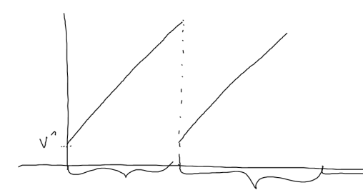
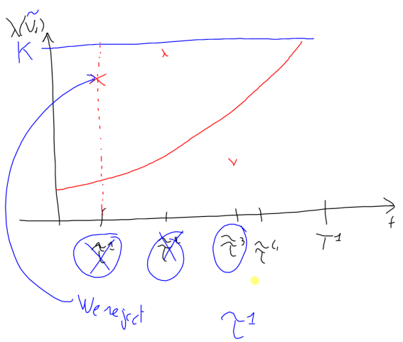

```{r setup, include=FALSE}
knitr::opts_chunk$set(echo = TRUE, warning = FALSE, message = FALSE)
```

# Piecewise Deterministic Markov Processes (PDMP)

Considering a finite number of regimes $\{1, ..., P\}$, for each regime $i$, a continuous component $V_t$ of a PDMP evolves according to:

- an ordinary differential equation
- a given flow

$$\frac{dV_t}{dt}=b(i, V_t)$$

Such that:

$$V_t=\psi(i, t, v)$$

We have a jump rate $\lambda(i, V_t)$ and say the system jumps at rate $\lambda(i, V_t)$. It means that: $$\underset{\eta\rightarrow0}{lim}\frac{1}{\eta}\mathbb{P}(\text{jump between $t$ and $t+\eta$})=\lambda(i, V_t)$$

When a system jumps a new regime is chosen and thus a new position $V_t$.

## Simulating an example PDMP

### GOAL - Example setup

Our target PDMP displays the following properties:

\begin{align}
p&=1\\
\frac{dV_t}{dt}&=b(1, V_t)=1\\
\lambda(1, v)&=v^2\\
\text{At the jump }(1, v)&\rightarrow(1, V^{rest})
\end{align}



We are interested in this setup in the context of interspike interval distribution simulations and there will be implementing it below.

### METHOD - Implementing useful functions

We start by implementing 4 key functions:

- **isi_simulation_poor_robust** -- This function performs a PDMP simulation using a poor/robust algorithm
- **isi_simulation_rejection** -- This function performs a PDMP simulation using a thinning/rejection process
- **plot_simulation** -- Given a simulation, plots its key parameters (the jumps, and the $V_t$ and $\lambda(V_t)$ at the time of jump)
- **plot_jumps** -- Given a simulation function, plots against each other a given number of simulated jumps

<u>**Poor and robust algorithm**</u>
Given an interval $[0, T_{max}]$ on which to simulate a PDMP, we introduce a discretization parameter (or time step) $\eta$ such that given the setup:

\begin{align}
p&=1\\
\frac{dV_t}{dt}&=b(1, V_t)=1\\
\lambda(1, v)&=v^2\\
\text{At the jump }(1, v)&\rightarrow(1, V^{rest})
\end{align}

We have:

\begin{align}
\tilde{V}_{(k+1)\eta}&=\bar{V}_{k\eta}+\eta\\
\text{Bernoulli}(\lambda(\bar{V}_{k\eta})\eta)&=\mathcal{B}_k\\
\text{if }B_k = 1&\rightarrow\text{ the process spikes, }\bar{V}_{(k+1)\eta}=V^{rest}\\
\text{if }B_k = 0&\rightarrow\text{ the process does not spikes, }\bar{V}_{(k+1)\eta}=\tilde{V}_{(k+1)\eta}
\end{align}

<u>**Thinning/rejection algorithm**</u>

Given the rate function $\lambda(1, V_t)$, we consider the solution $\tilde{V}_t$ of $\frac{d\tilde{V}_t}{dt}=b(i, \tilde{V}_t)=1$ on a given interval $[0, T^1]$ with $T^1<T_{max}$.

We bound the rate $\lambda(\tilde{V}_t)$ with an upper bound $K$ on $[0, T^1]$ along with a rejection procedure on the same interval.



<u>**Simulation Functions**</u>

```{r}

bernoulli_probability <- function(eta, v) {min(v^2*eta, 1)}

lambda <- function(x){x^2}

isi_simulation_poor_robust <- function(Tmax, eta, v_rest){
  ### Simulates an interspike interval via piecewise deterministic markov 
  ### process on an interval [0, Tmax] discretized in chunks of length eta
  ### using a poor/robust algorithm
  timesteps = seq(0, Tmax, by=eta)
  # initializes the vectors of jumps, V_t, and lambda(V_t)
  jumps = c()
  v_t = c(v_rest)
  lambdas = c(v_rest^2)
  for (step in timesteps){
    # Computes the probability of a jump in a given timestep
    v_tilde = bernoulli_probability(eta, tail(v_t, 1))
    # Computes whether there is a jump
    bernoulli = rbinom(1, 1, v_tilde)
    if (bernoulli==1){
      # The process spikes and V_t goes back to v_rest
      new_v_t = v_rest
      # Records the jump position
      jumps = c(jumps, step)
    } else {
      # The process does not spike and V_t groes by one eta
      new_v_t = eta+tail(v_t, 1)
    }
    # Updates V_t and lambdas 
    v_t = c(v_t, new_v_t)
    lambdas = c(lambdas, new_v_t^2)
  }
  return(list("jumps"=jumps, "V_t"=v_t, "lambdas"=lambdas))
}

isi_simulation_rejection <- function(Tmax, T1, v_rest){
  ### Simulates an interspike interval via piecewise deterministic markov 
  ### process on an interval [0, Tmax] in steps of length eta using a
  ### thinning/rejection algorithm
  lower = 0
  upper = T1
  V = v_rest
  v_t = c(v_rest)
  lambdas = c(lambda(v_rest))
  jumps = c()
  while (T) {
    K = lambda(V+(lower-upper))
    draws = cumsum(rexp(10, K))
    draws = matrix(draws[draws < upper])
    check = apply(draws, 1, function(x){runif(1,0,K)<=lambda(V+x)})
    draw = draws[check][1]
    if (is.na(draw)){
      V = V + T1
      lower = upper
      upper = upper + T1
      next
    }
    lower = lower + draw
    if (lower > Tmax){
      break
    }
    jumps = c(jumps, lower)
    upper = lower + T1
    lambdas = c(lambdas, lambda(V+draw))
    v_t = c(v_t, V+draw)
    V = v_rest
  }
  return(list("jumps"=jumps, "V_t"=v_t, "lambdas"=lambdas))
}

```

<u>**Plotting Functions**</u>

```{r}

plot_simulation <- function(simulation, Tmax, eta, V_rest, rejection=F){
  title = paste("Simulated jumps on interval [0,", Tmax, "]\n",
                "with parameters eta=", eta, ", V^r=", V_rest,
                sep="")
  ### Plots the result of a PDMP simulation
  jumps = simulation$jumps
  lambdas = simulation$lambdas
  V_t =simulation$V_t
  # "Interpolates" the lambdas and V_t if the simulation was obtained 
  # via thinning
  new_jumps = c()
  new_lambdas = c()
  new_V_t = c()
  if (rejection) {
     jumps = c(0,jumps)
     for (i in 1:length(lambdas)) {
       new_jumps = c(new_jumps, c(jumps[i], jumps[i] + 1e-10))
       new_lambdas = c(new_lambdas, c(lambdas[i], V_rest^2))
       new_V_t = c(new_V_t, c(V_t[i], V_rest))
     }
     lambdas = new_lambdas
     V_t = new_V_t
  }
  par(mfrow=c(3,1), mai=c(0.3, 0.3, 0.4, 0.1))
  # Plots the jumps
  plot(jumps,
         rep(1,length(jumps)),
         col='red',yaxt='n',xlab='time',ylab='n',
         main=title,
         xlim=c(0,Tmax)
    )
  if (!rejection) {
    # Plots the lambda(V_t)
    plot(lambdas, 
         type="l",ylab="values",xlab="eta step",col="blue",
         main="lambda(V_t)"
    )
    # Plots V_t
    plot(V_t, 
         type="l",ylab="values",xlab="eta step",col="green",
         main="V_t"
    )
  } else {
    # Plots the lambda(V_t)
    plot(new_jumps,lambdas, 
         type="l",ylab="values",xlab="eta step",col="blue",
         main="lambda(V_t)", xlim=c(0,Tmax)
    )
    # Plots V_t
    plot(new_jumps,V_t, 
         type="l",ylab="values",xlab="eta step",col="green",
         main="V_t", xlim=c(0,Tmax)
    )
  }
  
}

plot_jumps <- function(simulation_function, Tmax, eta, V_rest, n_simulations){
  ### Plots a given number of simulated jumps against each other using a
  ### given simulation function
  for (i in 1:n_simulations) {
    # Simulates
    sim = simulation_function(Tmax, eta, V_rest)$jumps
    # Plots
    title = paste("10 simulated PDMP on interval [0,", Tmax, "]\n",
          "with parameters T^1 or eta=", eta, ", V^r=", V_rest,
          sep="")
    if (i==1) {
      plot(
        sim,rep(1,length(sim)),col=i+1, pch="|",
        xlab='time',ylab='simulations',
        ylim=c(1,n_simulations), xlim=c(0,Tmax), main=title)
    } else {
      points(sim,rep(i,length(sim)),col=i+1, pch="|")
    }
  }
}

```

### RESULTS - Simulation with the Poor/Robust algorithm

We decide to simulate a PDMP on the interval $[0, 10]$ with the Poor/Robust algorithm, given a discretization parameter $\eta=0.1$, a value $V$ at rest $V^r=2$.

The full PDMP setup becomes:

\begin{align}
p&=1\\
\frac{dV_t}{dt}&=1\\
\eta&=0.1\\
T_{max}&=10\\
V^r&=2\\
\lambda(1, v)&=v^2\\
\text{At the jump }(1, v)&\rightarrow(1, V^r)
\end{align}

```{r, out.width="100%"}

# Simulates
sim = isi_simulation_poor_robust(10,0.1,2)
# Plots a single simulations
plot_simulation(sim,10,0.1,2)
```

```{r, out.width="100%"}
# Plots jumps sequences for the given setup
plot_jumps(isi_simulation_poor_robust,10,0.1,2,10)

```


### RESULTS - Simulation with the Thinning/Rejection algorithm

We decide to simulate a PDMP on the interval $[0, 10]$ with the Thinning/Rejection algorithm, given an intermediary interval delimiter parameter $T^1=0.1$, a value $V$ at rest $V^r=2$.

The full PDMP setup becomes:

\begin{align}
p&=1\\
\frac{dV_t}{dt}&=1\\
T^1&=0.1\\
T_{max}&=10\\
V^r&=2\\
\lambda(1, v)&=v^2\\
\text{At the jump }(1, v)&\rightarrow(1, V^r)
\end{align}

```{r, out.width="100%"}

# Simulates
sim = isi_simulation_rejection(10,0.1,2)
# Plots a single simulations
plot_simulation(sim,10,0.1,2, T)
```

```{r, out.width="100%"}
# Plots jumps sequences for the given setup
plot_jumps(isi_simulation_rejection,10,0.1,2,10)

```

### RESULTS - Simulating PDMP with other parameters $\eta\text{ or }T^1$, $T_{max}$, $V^r$ to provide further examples

<u>**Case 1**</u>

\begin{align}
p&=1\\
\frac{dV_t}{dt}&=1\\
T^1=\eta&=0.1\\
T_{max}&=5\\
V^r&=0.1\\
\lambda(1, v)&=v^2\\
\text{At the jump }(1, v)&\rightarrow(1, V^r)
\end{align}

**Simulation**

```{r}

eta = 0.1
tmax = 5
vr = 0.1

# Simulates
sim_p = isi_simulation_poor_robust(tmax,eta,vr)
sim_r = isi_simulation_rejection(tmax,eta,vr)

```

**Plotting given the Poor/Robust Algorithm**

```{r, out.width="100%"}

# Plots a single simulations
plot_simulation(sim_p,tmax,eta,vr)
```
```{r, out.width="100%"}
plot_jumps(isi_simulation_rejection,tmax,eta,vr,10)

```

**Plotting given the Thinning/Rejection Algorithm**


```{r, out.width="100%"}

# Plots a single simulations
plot_simulation(sim_r,tmax,eta,vr,T)
```
```{r, out.width="100%"}
plot_jumps(isi_simulation_rejection,tmax,eta,vr,10)

```

<u>**Case 2**</u>

\begin{align}
p&=1\\
\frac{dV_t}{dt}&=1\\
T^1=\eta&=0.01\\
T_{max}&=1\\
V^r&=2\\
\lambda(1, v)&=v^2\\
\text{At the jump }(1, v)&\rightarrow(1, V^r)
\end{align}

**Simulation**

```{r}

eta = 0.01
tmax = 1
vr = 2

# Simulates
sim_p = isi_simulation_poor_robust(tmax,eta,vr)
sim_r = isi_simulation_rejection(tmax,eta,vr)

```

**Plotting given the Poor/Robust Algorithm**

```{r, out.width="100%"}

# Plots a single simulations
plot_simulation(sim_p,tmax,eta,vr)
```
```{r, out.width="100%"}
plot_jumps(isi_simulation_rejection,tmax,eta,vr,10)

```

**Plotting given the Thinning/Rejection Algorithm**

```{r, out.width="100%"}

# Plots a single simulations
plot_simulation(sim_r,tmax,eta,vr,T)
```
```{r, out.width="100%"}
plot_jumps(isi_simulation_rejection,tmax,eta,vr,10)

```

<u>**Case 3**</u>

\begin{align}
p&=1\\
\frac{dV_t}{dt}&=1\\
T^1=\eta&=0.05\\
T_{max}&=20\\
V^r&=3\\
\lambda(1, v)&=v^2\\
\text{At the jump }(1, v)&\rightarrow(1, V^r)
\end{align}

**Simulation**

```{r}

eta = 0.05
tmax = 20
vr = 3

# Simulates
sim_p = isi_simulation_poor_robust(tmax,eta,vr)
sim_r = isi_simulation_rejection(tmax,eta,vr)

```

**Plotting given the Poor/Robust Algorithm**

```{r, out.width="100%"}

# Plots a single simulations
plot_simulation(sim_p,tmax,eta,vr)
```
```{r, out.width="100%"}
plot_jumps(isi_simulation_rejection,tmax,eta,vr,10)

```

**Plotting given the Thinning/Rejection Algorithm**

```{r, out.width="100%"}

# Plots a single simulations
plot_simulation(sim_r,tmax,eta,vr,T)
```
```{r, out.width="100%"}
plot_jumps(isi_simulation_rejection,tmax,eta,vr,10)

```

### COMMENTS

With the examples shown above, we can evidence that PDMP are highly dependent to their initial parameters (e.g. $V^r$, $\eta$, $\lambda(.)$, etc.). 

Furthermore, we mentioned that this process is intended to model interspike intervals. By a visual check, we can see that, if we were to tweak our parameters, we could find convincing simulation via the use of PDMP. An example to keep in mind is the latest implementation, which we could compare with example interspike interval such as those available in the STAR package:

```{r, out.width="100%"}

library(STAR)
data(e070528citronellal)
e070528citronellal$`neuron 3`

```