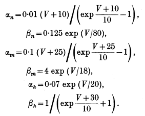
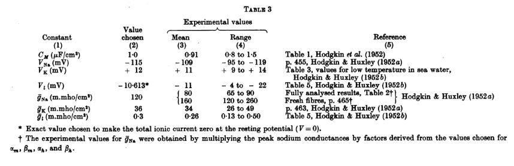
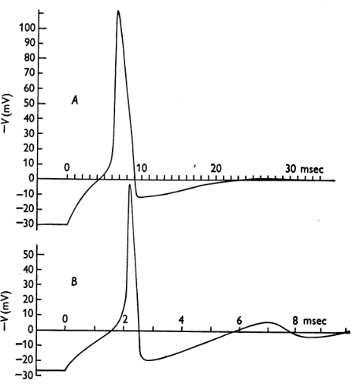

```{r setup, include=FALSE}
knitr::opts_chunk$set(echo = TRUE, warning = FALSE, message = FALSE)
```

# Hodgkin-Huxley Context

The Hodgkin-Huxley piecewise deterministic markov process is a model introduced by Alan Hodgkin and Andrew Huxley in 1952 with the paper "[A quantitative description of membrane current and its application to conduction and excitation in nerve](https://pubmed.ncbi.nlm.nih.gov/12991237/)." The Hodgkin-Huxley model targets the initiation and propagation of an action potential in a neuron (e.g. current carried through a neuron with ions penetrating or charging its membrane).

As such, the capacitive current or capacitance flowing through  the neuron's membrane is defined as:

\begin{align}
I &= C_m\frac{dV}{dt} + I_{ion}\\
C_m\frac{dV}{dt} &=- I_{ion}\\
I_{ion} &^= g_{Na}m^3h(V-E_{Na}) + g_Kn^4(V-E_K)+g_L(V-E_L)
\end{align}

Where:

- $I$ is current per unit area
- $C_m$ is the capacitance (constant)
- $V$ is the membrane voltage/potential
- $I_{ion}$ is the current source caused by the Sodium (Na), Potassium (K) and other leaking (L) ions 
- $g_i$ is the electrical conductance of voltage-gated $i$-ion channels of the gates $m$, $n$, and $h$
- $E$ is the equilibrium potential (voltage sources) of the gates associated with Sodium (Na), Potassium (K) and other leaking (L) ions

The Hodgkin-Huxley equation above is complemented with the following three differential equations:

\begin{align}
\frac{dm}{dt}&=\alpha_m(V)(1-m)-\beta_m(V)m\\
\frac{dh}{dt}&=\alpha_h(V)(1-h)-\beta_h(V)h\\
\frac{dn}{dt}&=\alpha_n(V)(1-n)-\beta_n(V)n
\end{align}

The rate constants $\forall i \in \{Na, K, L\},\,\alpha_i$ and $\beta_i$ are rate functions estimated by fitting empirical functions of votage to the experimental data in the Hodgkin-Huxley paper such that:

<center></center>

In the original model, Hodgkin and Huxley established that there were three identical activation gates $m$ and one gate $h$ to explain the Sodium (Na) current, and four identical activation gates $n$ for the Potassium (K) current.


## Simulating an example Hodgkin-Huxley PDMP

### GOAL

We are interested in implementing the Hodgkin-Huxley model described above with one hundred gates/doors of each time ($m$, $h$, and $n$).

As such, we will first implement the original model shown above, using $m$, $h$, and $n$ as inputs to modulate the HHPDMP outputs. Then we will implement the example with 100 doors of each type.

### METHOD

<u>Setup:</u>

We consider 3 types of doors $m$, $h$, and $n$ such that:

- With $t$ a given timestep, $\forall i\in\{m, h, n\},\,N^i$ is the number of doors $X_t^i$ of type $i$
- Each door of type $i$ has two states $0$ and $1$ with respective transition probabilities:

\begin{align}
\forall i\in\{m, h, n\},\,\mathbb{P}_i(0\rightarrow1)&=\alpha_i(V_t)\\
\mathbb{P}_i(1\rightarrow0)&=\beta_i(V_t)\\
\end{align}

We consider $\hat{m}_t$, $\hat{h}_t$, and $\hat{n}_t$ the respective proportion of open doors of each type such that:

\begin{align}
\hat{m}_t &= \frac{1}{N^m}\underset{i=1}{\overset{N^m}{\sum}}X^{m,i}_t\\
\hat{h}_t &= \frac{1}{N^h}\underset{i=1}{\overset{N^h}{\sum}}X^{h,i}_t\\
\hat{n}_t &= \frac{1}{N^n}\underset{i=1}{\overset{N^n}{\sum}}X^{n,i}_t
\end{align}

The regimes of a Hodgkin-Huxley PDMP corresponds to the *whole* state $\big(\frac{k^m}{N^m}, \frac{k^h}{N^h}, \frac{k^n}{N^n}\big)$ or $\big(\hat{m}_t, \hat{h}_t, \hat{n}_t\big)$ where $\forall i\in\{m, h, n\},\,k^i$ corresponds to the number of open doors (i.e. $X_t^i=1$) The dynamics of $(\hat{V}_t)$ between the jumps is:

\begin{align}
C_m\frac{d}{dt}\hat{V}_t &= -g_L(\hat{V}_t - E_L) - \bar{g}_{Na} (\frac{k^m}{N^m})^3 \frac{k^h}{N^h} (\hat{V}_t - E_{Na}) - \bar{g}_K(\frac{k^n}{N^n})^4 (\hat{V}_t - E_K)\\
&= -g_L(\hat{V}_t - E_L) - \bar{g}_{Na} (\hat{m}_t)^3 \hat{h}_t (\hat{V}_t - E_{Na}) - \bar{g}_K(\hat{n}_t)^4 (\hat{V}_t - E_K)
\end{align}

The jumps for each type of door occur at rates:

\begin{align}
\hat{m}^t&\text{ jumps to }
  \begin{cases}
    \hat{m}^t-\frac{1}{N^m} & \text{ at rate }N^m\beta_m(\hat{V}_t)\hat{m}_t\\
    \hat{m}^t+\frac{1}{N^m} & \text{ at rate }N^m\alpha_m(\hat{V}_t)(1-\hat{m}_t)
  \end{cases}\\
\hat{h}^t&\text{ jumps to }
  \begin{cases}
    \hat{h}^t-\frac{1}{N^h} & \text{ at rate }N^h\beta_h(\hat{V}_t)\hat{h}_t\\
    \hat{h}^t+\frac{1}{N^h} & \text{ at rate }N^h\alpha_h(\hat{V}_t)(1-\hat{h}_t)
  \end{cases}\\
\hat{n}^t&\text{ jumps to }
  \begin{cases}
    \hat{n}^t-\frac{1}{N^n} & \text{ at rate }N^n\beta_n(\hat{V}_t)\hat{n}_t\\
    \hat{n}^t+\frac{1}{N^n} & \text{ at rate }N^n\alpha_n(\hat{V}_t)(1-\hat{n}_t)
  \end{cases}\\
\end{align}

With rates $\alpha_m, \alpha_h, \alpha_n, \beta_m, \beta_h$, and $\beta_n$ as stated in the original paper:

<center><br><i>(as previously stated)</i></center>

<u>Simulation method:</u>

We rely on a so-called "rough algorithm" such that, given small time steps $\delta$, we perform the following update at each time step:

$$\hat{V}_{t+\delta}\approx\hat{V}_t+\delta\frac{d\hat{V}_t}{dt}$$

Where:

\begin{align}
\forall i\in\{m,h,n\},\\
N^i&=100\\
\hat{i}_{t+\delta}&=
  \begin{cases}
    \hat{i}^t & \text{ w/ proba. }1 - \delta.N^i.\big[\beta_i(\hat{V}_t).\hat{i}_t + \alpha_i(\hat{V}_t).(1-\hat{i}_t)\big]\\
    \hat{i}^t-\frac{1}{N^i} & \text{ w/ proba. }\delta.N^i.\beta_i(\hat{V}_t).\hat{i}_t\\
    \hat{i}^t+\frac{1}{N^i} & \text{ w/ proba. }\delta.N^i.\alpha_i(\hat{V}_t).(1-\hat{i}_t)
  \end{cases}\\
\frac{d}{dt}\hat{V}_t &= \frac{-g_L(\hat{V}_t - E_L) - \bar{g}_{Na} (\hat{m}_t)^3 \hat{h}_t (\hat{V}_t - E_{Na}) - \bar{g}_K(\hat{n}_t)^4 (\hat{V}_t - E_K)}{C_m}
\end{align}

And where the $\alpha$ and $\beta$ rate functions are taken from the original paper along with the following parameters:

<center></center>

<u>Function implementations:</u>

```{r functions}

# Declares all intermediary rate functions alpha_i and beta_i

# Alpha and Beta rate function from original paper
am <- function(V) 0.1*(V+25)/(exp((V+25)/10)-1)
ah <- function(V) 0.07*exp(V/20)
an <- function(V) 0.01*(V+10)/(exp((V+10)/10)-1)
bm <- function(V) 4*exp(V/18)
bh <- function(V) 1/(exp((V+30)/10)+1)
bn <- function(V) 0.125*exp(V/80)

# Declares the V-differential function
dvdt <- function(V, Vl, Vna, Vk, gl, gna, gk, m, h, n, C) {
  -1/C * (gl*(V-Vl) + gna*m^3*h*(V-Vna) + gk*n^4*(V-Vk))
}

# Declares a generic function to update m, h, or n
update <- function(i, Ni, V, alpha, beta, delta) {
  # Draws uniformly a RV, and computes the jump probabilities 
  proba_down   = Ni*beta(V)*i*delta
  proba_up     = Ni*alpha(V)*(1-i)*delta
  uniform_draw = runif(1, 0, 1)
  # Checks whether a jump occurs or not
  if (uniform_draw <= proba_down) {
    return(i - 1/Ni)
  } else if (uniform_draw <= proba_down + proba_up) {
    return(i + 1/Ni)
  } else {
    return(i)
  }
}

hodgkin_huxley_PDMP <- function(
  time_length, timestep,
  C, 
  Vl, Vna, Vk, 
  m, h, n,
  gl, gna, gk,
  Nm, Nh, Nn,
  am, ah, an, bm, bh, bn,
  V, Vr=0
) {
  ### Hudgkin Huxley PDMP function using a rough algorithm
  ### relying on jump probabilities at given small timesteps delta
  # Declares the return space
  V = + V - Vr # negative depolarization in mV
  interval = matrix(seq(0, time_length, timestep))
  V_seq    = matrix(rep(V, length(interval)))
  m_seq    = matrix(rep(m, length(interval)))
  h_seq    = matrix(rep(h, length(interval)))
  n_seq    = matrix(rep(n, length(interval)))
  # Performs the iterative update per timestep
  for (i in 2:length(interval)) {
    # Updates m, h, and n
    m_seq[i] = update(m_seq[i-1,], Nm, V_seq[i-1,], am, bm, timestep)
    h_seq[i] = update(h_seq[i-1,], Nh, V_seq[i-1,], ah, bh, timestep)
    n_seq[i] = update(n_seq[i-1,], Nn, V_seq[i-1,], an, bn, timestep)
    # Updates V
    V_seq[i] = V_seq[i-1,] + timestep*dvdt(
      V_seq[i-1,], Vl, Vna, Vk, gl, gna, gk,
      m_seq[i,], h_seq[i,], n_seq[i,], C
    )
  }
  # Plots the resulting simulation
  par(mfrow = c(2, 2), mar=c(2.8,2.5,2.5,2), mgp=c(1.8, 0.75, 0))
  # OF NOTE: the paper displays the V values as its negative
  # see example graph page 537 here:
  # https://physiology.arizona.edu/sites/default/files/hodgkinhuxley1952_0.pdf
  plot(interval, -V_seq, type="l", col='red', 
       xlab="mS", ylab="-V(mV)")
  plot(interval, m_seq, type="l", col='blue', 
       xlab="mS", ylab="Proportion open m gates")
  plot(interval, h_seq, type="l", col='green', 
       xlab="mS", ylab="Proportion open h gates")
  plot(interval, n_seq, type="l", col='purple',
       xlab="mS", ylab="Proportion open n gates")
  title = paste("Simulation results over", time_length, "(milliseconds)\n",
                "with a timestep of", timestep, "(milliseconds)")
  mtext(title, side = 1, line = -29, outer=TRUE)
  # Returns
  return(list(
    "timesteps"=interval, 
    "V"=V_seq, "-V"=-V_seq,
    "m"=m_seq, "h"=h_seq, "n"=n_seq
    )
  )
}

```

Of note, up until now, we have shown the modeling of $V$ (in microVolt $mV$). In the original paper, the authors then switch to data visualizing the modeling of $V$ via its inverse $-V$ such as in page 537 [here](https://physiology.arizona.edu/sites/default/files/hodgkinhuxley1952_0.pdf) and reproduced below:

<center></center>

As such, the function declared above returns both $V$ and $-V$ but will only display graphically the latter to keep with the original paper's format.

### RESULTS - Simulation with the Rough algorithm

<u>Declaring the general parameter space:</u>

| Parameters | Value | Note |
| --- | --- | --- |
| length | 100 | milliseconds  |
| timestep $\delta$ | 0.01 | milliseconds |
| $C_m$ | 1 | *taken from original paper* |
| $V_l$ | -10.615 | *taken from original paper* |
| $V_{Na}$ | -115 | *taken from original paper* |
| $V_k$ | 12 | *taken from original paper* |
| $m$ | 0.7 | arbitrary choice |
| $h$ | 0.3 | arbitrary choice |
| $n$ | 0.1 | arbitrary choice |
| $g_l$ | 0.3 | *taken from original paper* |
| $g_{Na}$ | 120 | *taken from original paper* |
| $g_k$ | 36 | *taken from original paper* |
| $Nm$ | 100 | arbitrary choice |
| $Nh$ | 100 | arbitrary choice |
| $Nn$ | 100 | arbitrary choice |
| $V$ | 30 | *taken from original paper* |
| $V_r$ | 0 | *taken from original paper* |

```{r params}

# Declares parameters
time_length = 100     # arbitrary choice
timestep    = 0.01    # arbitrary choice
C           = 1       # paper OG value (resting potential 0)
# Conductance levels
Vl          = -10.613 # paper OG value (resting potential 0)
Vna         = -115    # paper OG value (resting potential 0)
Vk          = 12      # paper OG value (resting potential 0)
# Initial open proportions
m           = 0.7     # arbitrary choice
h           = 0.3     # arbitrary choice
n           = 0.1     # arbitrary choice
# Conductance values
gl          = 0.3     # paper OG value (resting potential 0) 
gna         = 120     # paper OG value (resting potential 0)
gk          = 36      # paper OG value (resting potential 0)
# number of doors
Nm          = 100     # arbitrary choice
Nh          = 100     # arbitrary choice
Nn          = 100     # arbitrary choice
# Membrane displacement potential (negative depolarization)
V           = 30      # arbitrary choice (original paper has V starting around 30)
# For V, see page 536 here:
# https://physiology.arizona.edu/sites/default/files/hodgkinhuxley1952_0.pdf
Vr          = 0       # paper OG value (resting potential 0)

```

<u>Varying the timelength with a given timestep of 0.01:</u>

```{r results, out.width="100%"}

simulation = hodgkin_huxley_PDMP(
  time_length, timestep,
  C, 
  Vl, Vna, Vk, 
  m, h, n,
  gl, gna, gk,
  Nm, Nh, Nn,
  am, ah, an, bm, bh, bn,
  V, Vr
)

```

```{r results_2, out.width="100%"}

# Declares parameters
time_length = 1000 # arbitrary choice

simulation = hodgkin_huxley_PDMP(
  time_length, timestep,
  C, 
  Vl, Vna, Vk, 
  m, h, n,
  gl, gna, gk,
  Nm, Nh, Nn,
  am, ah, an, bm, bh, bn,
  V, Vr
)

```

```{r results_3, out.width="100%"}

# Declares parameters
time_length = 10 # arbitrary choice

simulation = hodgkin_huxley_PDMP(
  time_length, timestep,
  C, 
  Vl, Vna, Vk, 
  m, h, n,
  gl, gna, gk,
  Nm, Nh, Nn,
  am, ah, an, bm, bh, bn,
  V, Vr
)

```

<u>Varying the timelength with a given timestep of 0.001:</u>

```{r results_4, out.width="100%"}

# Declares parameters
time_length = 100   # arbitrary choice
timestep    = 0.001 # arbitrary choice

simulation = hodgkin_huxley_PDMP(
  time_length, timestep,
  C, 
  Vl, Vna, Vk, 
  m, h, n,
  gl, gna, gk,
  Nm, Nh, Nn,
  am, ah, an, bm, bh, bn,
  V, Vr
)

```

```{r results_5, out.width="100%"}

# Declares parameters
time_length = 1000  # arbitrary choice

simulation = hodgkin_huxley_PDMP(
  time_length, timestep,
  C, 
  Vl, Vna, Vk, 
  m, h, n,
  gl, gna, gk,
  Nm, Nh, Nn,
  am, ah, an, bm, bh, bn,
  V, Vr
)

```

```{r results_6, out.width="100%"}

# Declares parameters
time_length = 10    # arbitrary choice

simulation = hodgkin_huxley_PDMP(
  time_length, timestep,
  C, 
  Vl, Vna, Vk, 
  m, h, n,
  gl, gna, gk,
  Nm, Nh, Nn,
  am, ah, an, bm, bh, bn,
  V, Vr
)

```

<u>Varying the timelength with a given timestep of 0.1:</u>

```{r results_7, out.width="100%"}

# Declares parameters
time_length = 100   # arbitrary choice
timestep    = 0.1 # arbitrary choice

simulation = hodgkin_huxley_PDMP(
  time_length, timestep,
  C, 
  Vl, Vna, Vk, 
  m, h, n,
  gl, gna, gk,
  Nm, Nh, Nn,
  am, ah, an, bm, bh, bn,
  V, Vr
)

```

```{r results_8, out.width="100%"}

# Declares parameters
time_length = 1000   # arbitrary choice

simulation = hodgkin_huxley_PDMP(
  time_length, timestep,
  C, 
  Vl, Vna, Vk, 
  m, h, n,
  gl, gna, gk,
  Nm, Nh, Nn,
  am, ah, an, bm, bh, bn,
  V, Vr
)

```

```{r results_9, out.width="100%"}

# Declares parameters
time_length = 10   # arbitrary choice

simulation = hodgkin_huxley_PDMP(
  time_length, timestep,
  C, 
  Vl, Vna, Vk, 
  m, h, n,
  gl, gna, gk,
  Nm, Nh, Nn,
  am, ah, an, bm, bh, bn,
  V, Vr
)

```

<u>Varying gate conductance parameters:</u>

```{r results_gates_1, out.width="100%"}

# Declares parameters
time_length = 100     # arbitrary choice
timestep    = 0.01    # arbitrary choice
# Initial open proportions
m           = 0    # arbitrary choice
h           = 0    # arbitrary choice
n           = 0    # arbitrary choice

simulation = hodgkin_huxley_PDMP(
  time_length, timestep,
  C, 
  Vl, Vna, Vk, 
  m, h, n,
  gl, gna, gk,
  Nm, Nh, Nn,
  am, ah, an, bm, bh, bn,
  V, Vr
)

```

```{r results_gates_12, out.width="100%"}

# Declares parameters
time_length = 100     # arbitrary choice
timestep    = 0.01    # arbitrary choice
# Initial open proportions
m           = 1    # arbitrary choice
h           = 1    # arbitrary choice
n           = 1    # arbitrary choice

simulation = hodgkin_huxley_PDMP(
  time_length, timestep,
  C, 
  Vl, Vna, Vk, 
  m, h, n,
  gl, gna, gk,
  Nm, Nh, Nn,
  am, ah, an, bm, bh, bn,
  V, Vr
)

```

```{r results_gates_2, out.width="100%"}

# Declares parameters
time_length = 100     # arbitrary choice
timestep    = 0.01    # arbitrary choice
# Initial open proportions
m           = 0.7     # arbitrary choice
h           = 0.3     # arbitrary choice
n           = 0.1     # arbitrary choice
# Conductance levels
Vl          = -100    
Vna         = -100    
Vk          = 100     

simulation = hodgkin_huxley_PDMP(
  time_length, timestep,
  C, 
  Vl, Vna, Vk, 
  m, h, n,
  gl, gna, gk,
  Nm, Nh, Nn,
  am, ah, an, bm, bh, bn,
  V, Vr
)

```

```{r results_gates_3, out.width="100%"}

# Declares parameters
time_length = 100     # arbitrary choice
timestep    = 0.01    # arbitrary choice
# Conductance levels
Vl          = 0       # arbitrary choice
Vna         = -10     # arbitrary choice
Vk          = 10      # arbitrary choice

simulation = hodgkin_huxley_PDMP(
  time_length, timestep,
  C, 
  Vl, Vna, Vk, 
  m, h, n,
  gl, gna, gk,
  Nm, Nh, Nn,
  am, ah, an, bm, bh, bn,
  V, Vr
)

```


```{r results_gates_4, out.width="100%"}

# Declares parameters
time_length = 100     # arbitrary choice
timestep    = 0.01    # arbitrary choice
# Conductance levels
Vl          = 10.613  # arbitrary choice
Vna         = 115     # arbitrary choice
Vk          = -12     # arbitrary choice

simulation = hodgkin_huxley_PDMP(
  time_length, timestep,
  C, 
  Vl, Vna, Vk, 
  m, h, n,
  gl, gna, gk,
  Nm, Nh, Nn,
  am, ah, an, bm, bh, bn,
  V, Vr
)

```

### COMMENTS

Starting with the following baseline set of parameters:

| Parameters | Value | Note |
| --- | --- | --- |
| length | 100 | milliseconds  |
| timestep $\delta$ | 0.01 | milliseconds |
| $C_m$ | 1 | *taken from original paper* |
| $V_l$ | -10.615 | *taken from original paper* |
| $V_{Na}$ | -115 | *taken from original paper* |
| $V_k$ | 12 | *taken from original paper* |
| $m$ | 0.7 | arbitrary choice |
| $h$ | 0.3 | arbitrary choice |
| $n$ | 0.1 | arbitrary choice |
| $g_l$ | 0.3 | *taken from original paper* |
| $g_{Na}$ | 120 | *taken from original paper* |
| $g_k$ | 36 | *taken from original paper* |
| $Nm$ | 100 | arbitrary choice |
| $Nh$ | 100 | arbitrary choice |
| $Nn$ | 100 | arbitrary choice |
| $V$ | 30 | *taken from original paper* |
| $V_r$ | 0 | *taken from original paper* |

We can observe the following:

- Given a simulation timestep $\delta$ of 0.01 or 0.001 milliseconds, we find that we have, in general, a simulated spike every 20 to 30 milliseconds.
- Increasing the timestep $\delta$ to 0.1 milliseconds alters the behavior of the rough simulation -- indicating that the function might not work at high timestep resolutions:
  - Only one spike is generated
  - The spike's shape differs from other setups with a smaller/finer $\delta$
- Given a simulation timestep $\delta$ of 0.01 and a simulated length of $100$ milliseconds, we find:
  - <u>Setting the initial proportions $m$, $h$, and $n$ to either 0 or 1</u> does not seem to affect the general behavior of the simulation after a few steps as the proportions' behavior seem to converge back to what was observed in the very first simulation
  - <u>Modifying the ion capacitance $V_l$, $V_{Na}$, and $V_k$:</u> strongly affects the simulation's behavior
    - Increasing each value $V_l$, $V_k$, $V_{Na}$ by an order of magnitude seems to double or triple the number of generated spikes
    - Reducing these values or nullifying them leads to an absence of spikes and a capacitance $V$ hovering around 0
    - Inverting the values $V_l$, $V_k$, $V_{Na}$ as stated in the original paper also leads to an absence of spikes and a capacitance $V$ converging towards 0

<hr>
<hr>
<hr>

### IMPLEMENTATION OF THE DIFFERENTIAL MODEL WITH THE SIMECOL LIBRARY

Exported from the [R-bloggers](https://www.r-bloggers.com/2012/06/hodgkin-huxley-model-in-r/) website, it is possible to perform a Hodgkin-Huxley dynamic simulation (here with Ordinary Differential Equations (ODE) from the [simecol library](http://simecol.r-forge.r-project.org/)). 

We note that the provided rate functions $\alpha$ and $\beta$ differs from the original paper. 

```{r library_install}

# install.packages("simecol")
library(simecol)

```

```{r HH_model}

## Hodkin-Huxley model
HH <- odeModel(
main = function(time, init, parms) {
  with(as.list(c(init, parms)),{

    am <- function(v) 0.1*(v+40)/(1-exp(-(v+40)/10))
    bm <- function(v) 4*exp(-(v+65)/18)
    ah <- function(v) 0.07*exp(-(v+65)/20)
    bh <- function(v) 1/(1+exp(-(v+35)/10))
    an <- function(v) 0.01*(v+55)/(1-exp(-(v+55)/10))
    bn <- function(v) 0.125*exp(-(v+65)/80)
    
    dv <- (I - gna*h*(v-Ena)*m^3-gk*(v-Ek)*n^4-gl*(v-El))/C
    dm <- am(v)*(1-m)-bm(v)*m
    dh <- ah(v)*(1-h)-bh(v)*h
    dn <- an(v)*(1-n)-bn(v)*n
    
    return(list(c(dv, dm, dh, dn)))
  })
  },
  ## Set parameters
  parms = c(Ena=50, Ek=-77, El=-54.4, gna=120, gk=36, gl=0.3, C=1, I=0),
  ## Set integrations times
  times = c(from=0, to=40, by = 0.25),
  ## Set initial state
  init = c(v=-65, m=0.052, h=0.596, n=0.317),
  solver = "lsoda"
)

```

```{r run_model}

HH <- sim(HH)
plot(HH)

```
